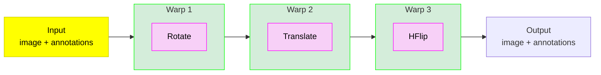
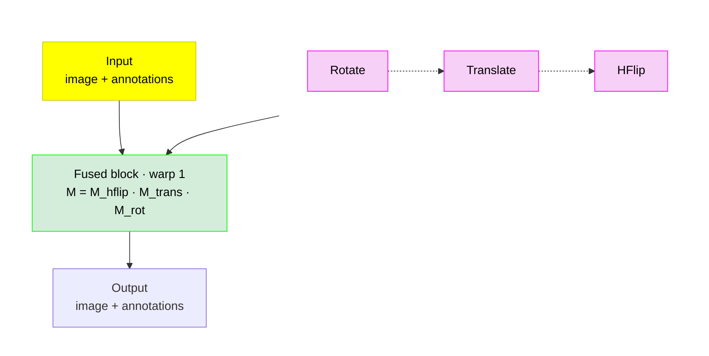

# ⚛️ Fuse augmentations

**Write image augmentation as independent transforms — from Kornia, TorchVision, Albumentations, or plain numeric ranges. Execute compatible geometry with fewer resampling passes, and compatible color as one fused matrix or lookup table.**

[](https://pypi.org/project/fuse-augmentations/) [](https://pypi.org/project/fuse-augmentations/) [](https://borda.github.io/fuse-augmentations/) [](https://github.com/Borda/fuse-augmentations/blob/main/LICENSE) [](https://github.com/Borda/fuse-augmentations/actions/workflows/ci_testing.yml)

`fuse-augmentations` is a PyTorch tensor-first engine for reducing repeated interpolation in image augmentation pipelines. It recognizes a finite set of Kornia, TorchVision, and Albumentations transforms—or builds a pipeline directly from numeric ranges—then composes compatible transform matrices before pixels are sampled.


> Animated WebP renders on GitHub and in any browser; macOS Preview and Finder Quick Look show only the first frame.

You keep the readable pipeline: rotate, scale, shear, translate, flip. The engine finds compatible runs and can replace several geometric warps with one.

> [!IMPORTANT]
>
> This package is Alpha and is **not** a general drop-in replacement for native Compose containers. It does not guarantee native pixels, input types, target processors, random streams, hooks, or universal speedups.

> [!WARNING]
>
> Use auxiliary targets only with explicitly supported spatial transforms. With `data_keys` present, an unknown or unclassified spatial passthrough is rejected before any segment executes, so the image and targets cannot silently diverge. Image-only calls may still run such a transform as a native passthrough; inspect every `Unknown ... SPATIAL_KERNEL barrier` warning before relying on it.

## 🔄 The problem: every warp resamples the image

A conventional chain may interpolate the same pixels after every geometric operation:

**Native composite — each transform is its own warp (3 warps):**



**Fused composite — the transforms collapse into one fused block (1 warp):**



Repeated interpolation adds work, creates intermediate tensors, and can progressively discard high-frequency detail. Matrix composition is cheap by comparison: for a compatible run, the package samples the individual parameters, multiplies their homogeneous matrices in declared order, and evaluates the result through one sampling grid.

This does **not** mean the fused output is pixel-identical to the native chain. It is a different resampling strategy, and backend centers, fill rules, clipping, and interpolation conventions still matter.

### Matched-parameter visual example

The same fixed Kornia rotation → scale → shear recipe is evaluated below. The native route resamples three times; Fuse Compose composes the geometry and samples once. The magenta/green/white overlay makes local disagreement visible without claiming native-pixel parity.


See [three fixed recipes for each of Kornia, TorchVision, and Albumentations](https://borda.github.io/fuse-augmentations/research/quality-and-fidelity/), including their exact limits.

## ✨ What the package can do

| Capability             | What is implemented                                                                                                                                                                                                  |
| ---------------------- | -------------------------------------------------------------------------------------------------------------------------------------------------------------------------------------------------------------------- |
| Affine fusion          | Registered rotation, affine, shear, translation, scale, and exact discrete operations are grouped within compatible same-backend runs.                                                                               |
| Exact geometry         | Supported flips and discrete operations use lossless tensor paths where the segment contract permits it.                                                                                                             |
| Projective fusion      | Consecutive registered perspective transforms compose as 3×3 homographies; affine↔projective transitions remain boundaries.                                                                                          |
| Linear color fusion    | Supported brightness, contrast, brightness/contrast-only `ColorJitter`, and standard RGB Normalize paths can collapse into color-matrix segments.                                                                    |
| Crop-resize            | Registered `RandomResizedCrop` has a dedicated segment; a preceding affine run can be absorbed on Kornia/TorchVision torch paths.                                                                                    |
| Flexible construction  | Native numeric ranges, Kornia transforms, TorchVision transforms, Albumentations transforms, or a mixed-backend list.                                                                                                |
| Portable configuration | Frozen `TransformSpec` values resolve a declarative pipeline against a chosen backend with strict unsupported-operation handling.                                                                                    |
| Auxiliary coordinates  | Masks, dense xyxy/xywh boxes, and dense keypoints can follow supported fused matrices, subject to the safety limits below.                                                                                           |
| Ragged detection       | `augment_detection_batch` adapts a `FusedCompose` with `data_keys=["input", "bbox_xyxy"]` to one TorchVision-style target mapping per image, including clipping and aligned filtering.                               |
| NumPy bridges          | HWC/BHWC NumPy ↔ BCHW torch converters and NumPy output are available; conversion to NumPy detaches and moves data to CPU.                                                                                           |
| Execution controls     | Albumentations cv2 or torch execution, Kornia-dependent downscale antialiasing, interpolation, padding, and color clipping policies.                                                                                 |
| Precision and compile  | Optional `torch.compile` of warp/color/LUT cores on non-CPU paths; opt-in `pipeline_dtype="bfloat16"\|"float16"` low-precision cores with matrices and parameter sampling kept in float32/64, no accuracy guarantee. |
| Plan inspection        | Human-readable plans, structured descriptors, a warp-saving estimate, and the last matrix-producing segment are exposed.                                                                                             |
| Training integration   | Pipelines are `nn.Module` objects and have tested pickle/serialization paths for common worker use.                                                                                                                  |

`antialias=True` is opt-in for aggressive crop-resize downscales. It evaluates each sample's scale and prefilters only samples that need it; enabling the option requires Kornia and raises `ImportError` during pipeline construction when that optional dependency is missing. The default remains unfiltered and does not require Kornia.

### Built-in live-transform coverage

This is an allowlist, not a claim about every upstream transform. Rows are primitives named by the most common class name across backends; a check means the backend registers that class name, otherwise the cell shows the backend-specific class, entry point, or a note. Native/direct cells name the `Compose.from_params` arguments.

**Geometry**

| Primitive              | Kornia             | TorchVision v1/v2  | Albumentations                        | Native/direct        |
| ---------------------- | ------------------ | ------------------ | ------------------------------------- | -------------------- |
| `RandomRotation`       | ✓                  | ✓ (`expand=False`) | `Rotate`, `SafeRotate`                | `rotation`           |
| `RandomAffine`         | ✓                  | ✓                  | `Affine`, `ShiftScaleRotate`          | —                    |
| Scale                  | via `RandomAffine` | via `RandomAffine` | via `Affine`, `ShiftScaleRotate`      | `scale`, `scale_x/y` |
| `RandomShear`          | ✓                  | —                  | —                                     | `shear_x`, `shear_y` |
| `RandomTranslate`      | ✓                  | —                  | —                                     | `translate_x/y`      |
| `RandomHorizontalFlip` | ✓                  | ✓                  | `HorizontalFlip`                      | `hflip_p`            |
| `RandomVerticalFlip`   | ✓                  | ✓                  | `VerticalFlip`                        | `vflip_p`            |
| `RandomRotate90`       | `RandomRotation90` | —                  | ✓                                     | —                    |
| `D4`                   | —                  | —                  | ✓                                     | —                    |
| `Transpose`            | —                  | —                  | ✓                                     | —                    |
| `RandomPerspective`    | ✓                  | ✓                  | `Perspective`                         | —                    |
| `RandomResizedCrop`    | ✓                  | ✓                  | ✓ (backend-specific execution limits) | —                    |

**Color**

| Primitive          | Kornia                  | TorchVision v1/v2       | Albumentations                            | Native/direct |
| ------------------ | ----------------------- | ----------------------- | ----------------------------------------- | ------------- |
| `RandomBrightness` | ✓                       | via `ColorJitter`       | via `RandomBrightnessContrast`            | `brightness`  |
| `RandomContrast`   | ✓                       | via `ColorJitter`       | via `RandomBrightnessContrast`            | `contrast`    |
| `ColorJitter`      | ✓ (brightness/contrast) | ✓ (brightness/contrast) | —                                         | —             |
| `Normalize`        | ✓ (3-channel RGB)       | ✓ (3-channel RGB)       | ✓ (standard mode, 3-channel RGB)          | —             |
| `RandomGamma`      | ✓                       | —                       | ✓                                         | —             |
| `RandomSolarize`   | ✓                       | ✓                       | `Solarize`                                | —             |
| `RandomPosterize`  | ✓                       | ✓                       | `Posterize`                               | —             |
| `RandomEqualize`   | ✓ (float tensors only)  | ✓                       | `Equalize` (unmasked, `by_channels=True`) | —             |

Per-channel non-linear scalar maps — `gamma`, `solarize`, `posterize`, and supported per-channel `equalize` — are registered per backend as listed in the Color table above. Static maps compose into a table; equalize builds a separate per-image, per-channel histogram table at its runtime position, so static neighbours remain fused on either side. The uint8 Albumentations native path and the TorchVision equalize table match their native sequential operations exactly; Kornia's installed equalize accepts floating tensors only. The float tensor path retains an interpolation tolerance: it detects large lookup jumps and switches to a sharp step rule there, rather than smearing a discontinuity across a grid cell. Residual non-linear barriers include cross-channel `saturation`/`hue` and Albumentations masked or luminance (`by_channels=False`) equalize, which are not per-channel scalar maps.

Other unknown and nonlinear operations generally become passthrough barriers. That preserves pipeline construction in many image-only cases, but passthrough is not automatically numerically transparent, device-efficient, or auxiliary-target safe.

Gaussian blur is a narrow exception: consecutive Gaussian blurs fold into one operation, and a Gaussian blur commutes to the end of the run when the affine that immediately follows it does not downscale, letting that affine run collapse to a single warp (the surrounding affines then fuse as any affine chain does). Axis-aligned affine scales use Kornia's native Gaussian primitive; rotated (or sheared-and-upscaled) affines use a normalized sampled full-covariance Gaussian with 3-sigma support capped at 63 pixels. A pure shear has a smallest singular value below one, so it is refused like any other downscale — only a shear combined with enough upscale to keep both singular values at or above one reaches the covariance path. The blur stays a barrier when the following affine downscales (its smallest singular value drops below one), and always for projective transforms and non-linear kernels. Kornia's installed sharpness remains a barrier because it clamps intermediate values and restores borders, so it is not a linear shift-invariant kernel chain. The native Albumentations Gaussian path folds consecutive blurs only; it does not commute through affines because that fused path cannot guarantee the backend's random-number stream.

## 📦 Install

```bash
pip install fuse-augmentations
```

The base package requires Python 3.10+ and PyTorch 2.2+. It includes the native/direct builder.

Install optional adapter ecosystems only when needed:

```bash
pip install "fuse-augmentations[kornia]"
pip install "fuse-augmentations[torchvision]"
pip install "fuse-augmentations[albumentations]"
pip install "fuse-augmentations[all]"
```

## 🚀 Quick start: no optional augmentation backend

```python
import torch

from fuse_augmentations import Compose, ReorderPolicy

torch.manual_seed(7)

augment = Compose.from_params(
    rotation=(-15.0, 15.0),
    scale=(0.9, 1.1),
    shear_x=(-4.0, 4.0),
    translate_x=(-8.0, 8.0),
    hflip_p=0.5,
    reorder=ReorderPolicy.NONE,
)

images = torch.rand(4, 3, 128, 128, dtype=torch.float32)
augmented, matrix = augment(images, return_matrix=True)

assert augmented.shape == images.shape
assert augmented.dtype == images.dtype
assert matrix is not None
assert matrix.shape == (4, 3, 3)

print(augment.fusion_plan)
print(
    [
        (descriptor.kind, descriptor.n_warps_saved)
        for descriptor in augment.fusion_plan_descriptors
    ]
)
```

<details>
<summary>Fusion plan and saved warp count for the quick-start pipeline</summary>

```
fused(_DirectParamTransform, _DirectFlipTransform)
[('fused', 1)]
```

</details>

The common fused input contract is a floating BCHW torch tensor. Both `fuse_augmentations` and the shorter `fuse_aug` import expose the same public objects.

## 🔌 Bring an existing backend pipeline

```python
import torch
import torchvision.transforms.v2 as T

from fuse_augmentations import Compose, ReorderPolicy

augment = Compose(
    [
        T.RandomRotation(15.0),
        T.RandomAffine(degrees=0.0, scale=(0.9, 1.1)),
        T.RandomHorizontalFlip(p=0.5),
    ],
    reorder=ReorderPolicy.NONE,
)

output = augment(torch.rand(8, 3, 224, 224))
```

Kornia and Albumentations transform objects follow the same BCHW entry point when used in tensor pipelines. Albumentations also has an image-only HWC NumPy compatibility call, but it is not a replacement for native multi-target dictionaries and processors.

Mixed-backend pipelines are supported, with every backend change acting as a hard fusion boundary.

## 📊 What the measurements say

These numbers are historical smoke measurements from the 2026-07-12 local audit on macOS arm64, `fuse-augmentations 0.9.0.dev0`, Python 3.12, PyTorch 2.10, and 256×256 inputs. They demonstrate the shape of the opportunity, not current-head or release-wide performance. The [benchmark methodology](docs/research/methodology.md) records the controls still required before reusing them.

| Measurement                          |                                             Observed result | Interpretation                                                                                                                                                                    |
| ------------------------------------ | ----------------------------------------------------------: | --------------------------------------------------------------------------------------------------------------------------------------------------------------------------------- |
| Fixed 45-case CPU, batch-1 score     |            **1.79×** geometric mean of native/fused latency | Historical, unpaired smoke result; rerun after the benchmark RNG controls before using it as a comparison claim.                                                                  |
| Five-op geometric chain, CPU batch 1 |   **6.52× Kornia**, **14.48× TorchVision** in one quick run | Historical quick-run result; sampled-parameter pairing and endpoint equivalence were not established.                                                                             |
| Sampled CPU tensor peak memory       |                           **Withdrawn pending fresh sweep** | The historical profiler output is retained in the benchmark page for traceability; collect a new sweep with the corrected action-aware tool before citing peak/allocation ratios. |
| TorchVision 3-op, CPU batch 8 peak   |                           **Withdrawn pending fresh sweep** | The historical `117.5 MB → 38.0 MB` output must not be used as a memory claim until a corrected-tool sweep replaces it.                                                           |
| Apple MPS quick sweep                | Faster in only **9/28** comparable Kornia/TorchVision pairs | Historical quick sweep; benchmark the current pipeline on the deployment device.                                                                                                  |
| CUDA                                 |                  **Historical sweep documented separately** | The September 5, 2026 CUDA run is historical; current runner availability and current-head measurements are unverified.                                                           |

Single operations can be slower because there is no resampling to eliminate. Color-heavy pipelines retain color cost. Small accelerator workloads can be dominated by launch, sampling, compilation, or conversion overhead. Always benchmark the exact production pipeline and keep a correctness/parity gate beside the timing. See the [historical benchmark record](docs/research/benchmarks.md) for dated results and the current measurement boundaries.

The current benchmark tools have stricter contracts than the historical runs above. `bench_memory.py` accounts for live bytes, preexisting baseline, incremental peak, and physical allocation events; unavailable counters are recorded as null with an error. `bench_rfdetr_shape.py` makes all four variants reproducible and converts them to a common CPU model-ready endpoint: `float32` BCHW images in `[0, 1]`, `float32` `(N, 4)` boxes, and `int64` `(N,)` labels. It does not replay shared sampled geometry, so it is not a paired raster comparison. Collect a fresh sweep before replacing the withdrawn historical ratios.

## 🔬 Quality and semantics

Fusing geometry changes *when* interpolation happens. That can preserve more detail than repeatedly warping an already warped image, but it also means the result is not a byte-for-byte substitute for the native chain.

For research or parity-sensitive use:

- set `ReorderPolicy.NONE` explicitly;
- pair or record sampled parameters and matrices;
- compare output coordinates and task metrics, not only shapes;
- report backend, device, versions, dtype, image size, and batch size;
- separate compile warmup from steady-state timing;
- publish losses and skips alongside wins.

`POINTWISE` and `AGGRESSIVE` reordering are behavior-changing optimizations: moving color across geometry can alter border and clipped pixels. `AGGRESSIVE` currently behaves like `POINTWISE`.

## 🎯 Auxiliary targets: supported, but narrowly

Registered fused geometry can route:

- masks as BCHW tensors with nearest or bilinear sampling;
- boxes as dense `(B, N, 4)` xyxy or xywh tensors;
- keypoints as dense `(B, N, 2)` tensors.

Important boundaries:

- unknown or unclassified spatial transforms with auxiliary targets are rejected before execution; image-only passthroughs still need review;
- mask padding uses the independent scalar `mask_fill` (default `0`) even when image padding is border/reflection;
- nearest masks are intentionally detached; bilinear requires floating soft masks;
- boxes are AABB-wrapped after rotation but are not clipped or filtered;
- labels, visibility, ragged instances, invalid-box removal, and keypoint validity are application responsibilities;
- the Albumentations HWC NumPy path is image-only.

For detection and segmentation, validate every transform class and warning before training.

## 🔍 Introspection without overreading it

- `fusion_plan` describes the current segment structure.
- `fusion_plan_descriptors` provides structured, serializable segment metadata.
- `n_warps_saved` is a plan estimate, not a literal native interpolation counter for exact operations.
- `return_matrix=True` and `transform_matrix` expose the actual forward pixel-centre matrix from the **last supported matrix-producing segment**. Fused affine/projective, exact D4/flip/quarter-turn, and direct deterministic `letterbox` segments publish a `(B, 3, 3)` matrix; it is not an automatic whole-pipeline matrix across backend, projective, crop, or passthrough boundaries.

Use per-call matrix return when output and transform provenance must stay paired.

### Test-time de-augmentation

For one fused affine or projective geometric segment, pass the matrix returned by the same call to `inverse` to map a prediction back into the original frame. Exact and deterministic letterbox matrices are available for coordinate recovery through the target helpers, while the image inverse remains narrower. This pairing is safe for concurrent calls; `inverse` deliberately does not read the mutable `transform_matrix` property.

```python
import torch

from fuse_augmentations import Compose

augment = Compose.from_params(translate_x=(2.0, 2.0))
images = torch.rand(1, 3, 16, 16)
prediction_augmented, matrix = augment(images, return_matrix=True)
prediction_original = augment.inverse(prediction_augmented, matrix=matrix)

assert prediction_original.shape == images.shape
```

With `data_keys`, pass the augmented auxiliary targets in the same positional order; masks use the matching sampling grid and boxes/keypoints use the inverse pixel matrix. Keypoints and masks recover to sampling precision, but bounding boxes are axis-aligned: a forward-then-inverse box is exact only for axis-aligned transforms (flip, scale, translation) and inflates under a rotation, shear, or projective warp. `inverse` raises instead of guessing for crop-resize (cropped pixels are lost), color/LUT/blur or passthrough segments, exact-only segments, multiple segments, or a missing paired matrix. It is geometric-only and cannot recover values discarded by interpolation or padding.

For ragged detector targets, import `augment_detection_batch` from the package root. It requires a pipeline whose `data_keys` are exactly `["input", "bbox_xyxy"]`, accepts one mapping per image with floating `boxes` and int64 `labels`, and returns new mappings after pixel-edge clipping and aligned filtering. See [Detection and keypoints](docs/applications/detection-and-keypoints.md#augment-a-ragged-detector-batch) for optional fields and thresholds.

## 🎨 Synthetic datasets

Generate small labelled datasets of colored shapes — no training loop, no Lightning. Draw `square`/`rectangle`/`triangle`/`circle` in red/green/blue and export **COCO** or **YOLO** for **detection**, **segmentation**, or **oriented bounding box (OBB)**.

```python
import tempfile

from fuse_augmentations import generate_dataset

with tempfile.TemporaryDirectory() as out_dir:
    # COCO detection, 70/20/10 split, reproducible (pass a real path to keep it)
    counts = generate_dataset(
        out_dir, num_images=100, fmt="coco", task="detection", seed=0
    )

print(counts)
```

<details>
<summary>Per-split image counts for the synthetic COCO dataset</summary>

```
{'train': 70, 'val': 20, 'test': 10}
```

</details>

Swap `fmt="yolo"`, `task="obb"`, or `class_mode="color"` for other layouts, tasks, and class schemes.

`rectangle` plus random per-shape rotation give oriented boxes real orientation; all generation is seeded for byte-identical output. Generation streams — feed a training loop straight from `SyntheticGenerator.generate(n)` or a `DataLoader` via `SyntheticIterableDataset`, with no disk round-trip and bounded memory even for huge datasets. See the [synthetic datasets docs](docs/datasets/index.md) and `examples/generate_synthetic_dataset.py`.

## 🧭 Where it fits

Use `fuse-augmentations` when:

- data is already a BCHW torch tensor;
- the pipeline contains several registered geometric transforms;
- repeated resampling is a fidelity, memory, or throughput concern;
- you can validate output semantics for the exact backend and task.

Prefer the native backend container when you require:

- PIL or unbatched CHW input;
- full Albumentations dictionary processors;
- exact native centers, fills, pixels, hooks, or RNG behavior;
- unsupported spatial transforms with masks, boxes, or keypoints;
- backend-specific per-transform interpolation semantics; per-transform border modes are available with `padding_mode="per_transform"` when they map exactly, while opaque modes stay native boundaries with a warning and the default override is unchanged.

## 📚 Documentation

The repository includes a complete MkDocs Material site:

- [Overview](https://borda.github.io/fuse-augmentations/)
- [Installation and backend-free quickstart](https://borda.github.io/fuse-augmentations/getting-started/quickstart/)
- [How fusion works](https://borda.github.io/fuse-augmentations/concepts/how-fusion-works/)
- [Exact capabilities](https://borda.github.io/fuse-augmentations/concepts/capabilities/)
- [Backend and configuration guides](https://borda.github.io/fuse-augmentations/guides/backend-pipelines/)
- [Auxiliary-target safety](https://borda.github.io/fuse-augmentations/guides/auxiliary-targets/)
- [Reproducibility](https://borda.github.io/fuse-augmentations/guides/reproducibility/)
- [Quality and benchmark evidence](https://borda.github.io/fuse-augmentations/research/benchmarks/)
- [Research methodology](https://borda.github.io/fuse-augmentations/research/methodology/)
- [Known limitations](https://borda.github.io/fuse-augmentations/known-limitations/)
- [FAQ](https://borda.github.io/fuse-augmentations/faq/)
- [Application walkthroughs](https://borda.github.io/fuse-augmentations/applications/)
- generated references for the notable public API

The site configuration provides local search, per-page descriptions, canonical/Open Graph metadata, sitemap and crawler files, an `llms.txt` agent index, and GitHub Pages publication automation.

## 🧪 Reproduce the evidence

Benchmark and memory scripts live in [`experiments/`](https://github.com/Borda/fuse-augmentations/tree/main/experiments). They expose cases where fusion loses as well as wins.

```bash
uv run --all-extras --group benchmark python experiments/optimize_score.py
uv run --all-extras --group benchmark python experiments/bench_gpu_batch.py --quick
uv run --all-extras --group benchmark python experiments/bench_memory.py --quick
```

These three headline commands are not the full set: `experiments/` holds five benchmark scripts in total, including `bench_augmentation_pipelines.py`, `bench_primitive_vs_affine.py`, and `bench_rfdetr_shape.py`, and the [quality and benchmark evidence](https://borda.github.io/fuse-augmentations/research/benchmarks/) documentation page walks through all of them.

Treat quick runs as smoke evidence. Release-grade comparisons need independent processes, uncertainty intervals, paired RNG state, output-parity assertions, and full environment provenance.

## 🤝 Contributing

Bug reports and focused pull requests are welcome. Open an issue before a public API or architecture change.

Documentation example authoring and generated-test instructions are in [`CONTRIBUTING.md`](.github/CONTRIBUTING.md). Generated documentation tests are recreated in CI and should not be committed.

Build the docs locally with:

```bash
uv sync --group docs
uv run --group docs mkdocs build --strict
```

## 📄 License

[Apache-2.0](https://github.com/Borda/fuse-augmentations/blob/main/LICENSE) © 2025–2026 Jiri Borovec.
