# Customization and extension

## Reproducibility and tuning

Pass `seed=` for byte-identical output; all randomness flows through a single `numpy.random.Generator`. Tune content through `generate_dataset(**config_kwargs)` or a full `SyntheticConfig`:

```python
import tempfile

from synth_datasets import SplitRatios, generate_dataset

with tempfile.TemporaryDirectory() as out_dir:
    counts = generate_dataset(
        out_dir,
        num_images=200,
        fmt="yolo",
        task="obb",
        split_ratios=SplitRatios(train=0.8, val=0.2, test=0.0),
        img_size=64,
        max_objects=15,
        seed=42,
    )

print(counts)
```

<details>
<summary>Per-split image counts for the 80/20 OBB split</summary>

```
{'train': 160, 'val': 40}
```

</details>

`SyntheticConfig` knobs: `img_size`, `min_objects`/`max_objects`, `min_size_ratio`/`max_size_ratio`, `overlap_iou`, `boundary_tolerance`, `rotate`, `asymmetry_jitter`, `background`, `degrade`, `distractors`, `distractor_shapes`, `distractor_colors`, `occluders`, `class_mode`, `task`, `shapes`, `colors`. Overlapping candidates (IoU above `overlap_iou`) and out-of-bounds candidates (more than `boundary_tolerance` outside the frame) are rejected during placement.

`task` and `class_mode` are config fields only. `generate_dataset` takes no `task=` argument of its own — pass it as a keyword and it flows into the config, or set it on a `SyntheticConfig` you build yourself, but not both. Earlier releases accepted it in both places and cross-checked them, which meant a `None` sentinel, a conflict error, and a paragraph explaining which one won; one owner removes all three.

### Choosing a background

`background` accepts a plain fill — a `Color`, an `(r, g, b)` triple, or a `Fill` — or one of the background types, which carry their own parameters and render themselves. The mode *is* the type: a `NoiseBackground` has a `sigma` and a `TextureBackground` does not, so there is no combination of mode and parameter that has to be rejected by hand.

| type                     | parameters                                              | what it changes                                                     |
| ------------------------ | ------------------------------------------------------- | ------------------------------------------------------------------- |
| `SolidBackground`        | `color`                                                 | one flat fill — the default, and what a bare triple normalizes to   |
| `GradientBackground`     | `stops`, `direction`, `radial`                          | a linear or radial ramp, so intensity is no longer one global value |
| `NoiseBackground`        | `base`, `sigma`                                         | per-pixel Gaussian grain, which removes the trivial edge detector   |
| `ImpulseNoiseBackground` | `base`, `amount`, `salt_ratio`                          | salt-and-pepper pixels, heavy-tailed and blur-resistant             |
| `TextureBackground`      | `base`, `amplitude`, `frequency`, `octaves`, `quantize` | value noise at a chosen scale, so false positives become possible   |

Each picture below is a pair: on the left the canvas that mode painted, on the right that same canvas with the objects drawn onto it and their exported `bbox_xyxy` in yellow. The left half is there because a texture or a photographic crop stops being readable once shapes cover it.

=== "SolidBackground()"

    

=== "GradientBackground()"

    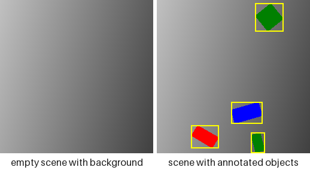

=== "GradientBackground(radial=True)"

    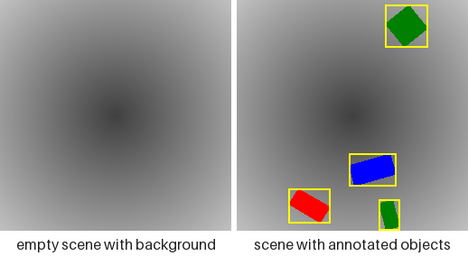

=== "NoiseBackground(sigma=24)"

    

=== "ImpulseNoiseBackground()"

    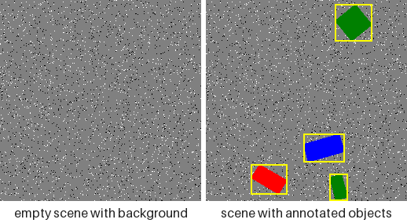

=== "TextureBackground()"

    

Every picture is rendered from one seed, so the three shapes sit in the same three places on every canvas above. That is not a rendering coincidence — it is the contract below, pictured. Regenerate them with `python examples/render_scene_gallery.py --groups backgrounds`, and the rest of this page's pictures by dropping the flag.

Every background draws from a side stream of its own, never from the placement stream, so switching one on at a fixed seed leaves every object exactly where it was:

```python
from synth_datasets import NoiseBackground, SyntheticConfig, SyntheticGenerator

flat = SyntheticConfig(img_size=64, max_objects=3)
noisy = SyntheticConfig(
    img_size=64,
    max_objects=3,
    background=NoiseBackground(sigma=24.0),
)

flat_stream = SyntheticGenerator(flat).generate(3, seed=1)
noisy_stream = SyntheticGenerator(noisy).generate(3, seed=1)

placements = [[a.bbox_xyxy for a in s.annotations] for s in flat_stream]
unmoved = [[a.bbox_xyxy for a in s.annotations] for s in noisy_stream]

print(placements == unmoved)
print(type(SyntheticConfig().background).__name__)
```

<details>
<summary>The same placements under a different canvas</summary>

```
True
SolidBackground
```

</details>

`config.background` reads back as a background object whichever spelling went in, so a caller that wants the flat fill asks for `config.background.color.rgb` rather than for the field itself. Two spellings that used to work no longer do: the field was previously handed straight to Pillow, so a colour *name* (`background="white"`, `background="#204080"`) reached `Image.new` and rendered. It is now validated like every other fill and raises at construction. Pass the triple — `(255, 255, 255)` — or a `Color` member. This is the first validation the field has ever had, and it is also what rejects a typo that previously rendered as black. Keep `NoiseBackground.sigma` at or below `32` for any run scored against a rasterized-ink oracle: the oracle finds ink by colour distance, Gaussian noise is unbounded, and its tail — not its mean — is what starts producing false ink above that.

### Photographic backgrounds

`ImageBackground` crops the canvas out of your own pictures, which buys the spatial statistics of real scenes without any labelling cost — the labels still come from the shapes drawn on top. It is the only mode that reads files the package does not ship, and the only one whose parameter has no default: there is nothing to ship a default directory from, and an empty one is refused at construction rather than rendered as black.

```python
import tempfile
from pathlib import Path

import numpy as np
from PIL import Image

from synth_datasets import ImageBackground, SyntheticConfig, SyntheticGenerator

with tempfile.TemporaryDirectory() as folder:
    Image.fromarray(np.full((64, 64, 3), 90, np.uint8)).save(Path(folder) / "wall.png")
    config = SyntheticConfig(img_size=48, background=ImageBackground(Path(folder)))
    sample = next(iter(SyntheticGenerator(config).generate(1, seed=0)))

print(sample.scene.background_source)
```

<details>
<summary>Which picture the sample stood on</summary>

```
wall.png
```

</details>

=== "ImageBackground(folder)"

    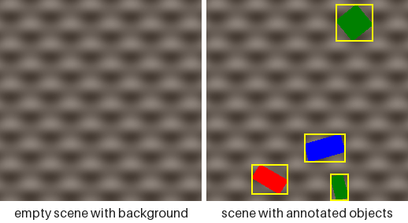

=== "ImageBackground(folder, grayscale=True)"

    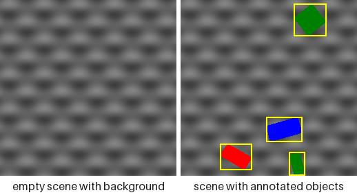

The two pictures above crop from a directory of generated pictures rather than photographs, since what the mode does with a file does not depend on what the file is of. `grayscale=True` is the right-hand one: same structure, no colour to compete with a colour-named class.

Which file a sample was cropped from reaches `sample.scene.background_source` as a POSIX-form path relative to `image_dir`, so a photographic dataset stays traceable rather than merely reproducible in principle. The directory is searched recursively, and every candidate is opened before the directory is accepted, so a corrupt file or a subdirectory that merely happens to end in `.png` is refused where you can see it rather than from inside the renderer. Files are listed in sorted order, so a seed picks the same picture on any machine; a picture smaller than the canvas is scaled up proportionally rather than refused; and `grayscale=True` keeps the structure while dropping the colour, which matters when the run's classes are colour-named and a photographic canvas would otherwise compete with them. The directory listing is cached per process — a background reading a directory that changes underneath it has no reproducible meaning anyway.

### Baking degradations into the pixels

`degrade` takes a tuple of pointwise effects applied, in order, after the last shape is drawn. Each changes pixel *values* and never pixel *positions*, so no label moves — anything geometric belongs to `FusedCompose`, not here.

| effect                 | parameter           | what it costs a model                                                     |
| ---------------------- | ------------------- | ------------------------------------------------------------------------- |
| `GaussianNoise(sigma)` | 0–32                | edge localisation and small-object recall                                 |
| `GaussianBlur(radius)` | 0–3 px              | corner keypoints, and the OBB angle on a square-ish shape                 |
| `JPEG(quality)`        | 1–95                | block artefacts around thin letter strokes                                |
| `Contrast(factor)`     | 0.3–1.0             | colour-mode classes converge toward each other                            |
| `ColorCast(gain)`      | per channel 0.7–1.3 | red-versus-green separation under a white balance error                   |
| `Vignette(strength)`   | 0–0.6               | objects near the border darken, which interacts with `boundary_tolerance` |
| `Quantize(levels)`     | 2–256               | flat fills band, a cheap stand-in for low bit depth                       |

Each picture pairs the effect on a bare canvas with the effect on the full scene, at the strength its tab names — stronger than the defaults in most cases, because a panel this size has to show what the knob does rather than what a conservative default looks like.

=== "none"

    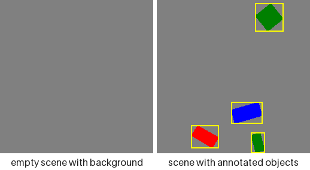

=== "GaussianNoise(sigma=16)"

    

=== "GaussianBlur(radius=1.5)"

    

=== "JPEG(quality=15)"

    

=== "Contrast(factor=0.45)"

    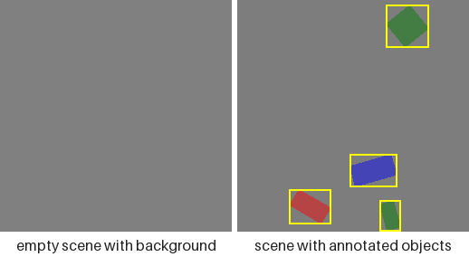

=== "ColorCast(gain=(1.3, 1.0, 0.7))"

    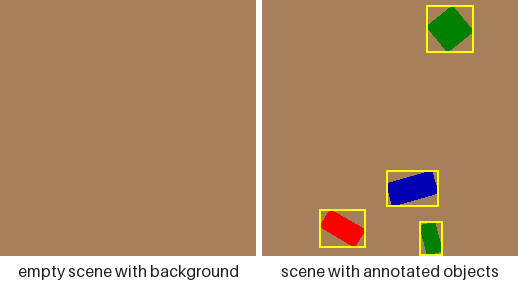

=== "Vignette(strength=0.7)"

    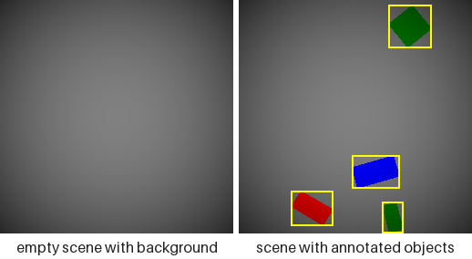

=== "Quantize(levels=4)"

    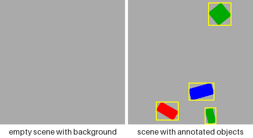

The pairing separates two costs that look alike in a single image. A degradation runs over the whole image, so the left panel is the effect on flat pixels and the right is the same effect where an edge has to survive it: `GaussianNoise` and `Quantize` visibly change the empty canvas, while `GaussianBlur` and `JPEG` leave it almost untouched and spend themselves entirely on the boundaries. Every picture carries the same boxes — not one of these effects moves a pixel, only recolours it.

This is not a duplicate of the augmentation pipeline. A `degrade` tuple describes pixels baked into an on-disk dataset — a fixed property of the data, replayable from its seed — where a transform in a training loop resamples every epoch, and a dataset can carry both:

```python
from synth_datasets import (
    JPEG,
    GaussianBlur,
    SyntheticConfig,
    SyntheticGenerator,
)

plain = SyntheticConfig(img_size=64, max_objects=3)
degraded = SyntheticConfig(
    img_size=64,
    max_objects=3,
    degrade=(GaussianBlur(radius=1.0), JPEG(quality=50)),
)

plain_stream = SyntheticGenerator(plain).generate(2, seed=0)
degraded_stream = SyntheticGenerator(degraded).generate(2, seed=0)

boxes = [a.bbox_xyxy for s in plain_stream for a in s.annotations]
unmoved = [a.bbox_xyxy for s in degraded_stream for a in s.annotations]

print(boxes == unmoved)
print(len(SyntheticConfig().degrade))
```

<details>
<summary>Degraded pixels, identical labels</summary>

```
True
0
```

</details>

Note what sits downstream of this chain: `generate_dataset` writes every image as JPEG at quality 95, so a dataset on disk already carries one lossy encode whatever `degrade` says. `JPEG(quality)` is therefore a second, harsher pass rather than the only one, and the exact `(255, 255, 255)`/`(0, 0, 0)` endpoints `ImpulseNoiseBackground` produces are softened by ringing on the way to disk — they survive intact only for a `Sample` consumed in memory. The floor of the difficulty ladder is set by the writer, not by the config.

The tuple is a tuple because order matters: blurring and then compressing is not the same picture as compressing and then blurring. Each step takes `uint8` and returns `uint8`, so quantisation error accumulates between steps rather than being carried in float to the end — which is what a real camera pipeline does.

### Adding unlabelled clutter

=== "neither"

    

=== "distractors=6"

    

=== "occluders=3"

    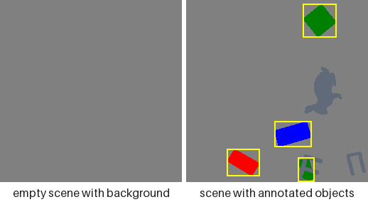

=== "distractors=6, occluders=3"

    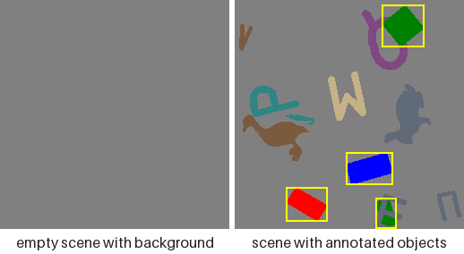

Two knobs add ink that no annotation mentions: `distractors` go under the labelled objects, `occluders` go over them, and the last picture runs both. Only the three labelled shapes carry a box, in all four — every other mark is unlabelled and stays that way, which is the entire point of these knobs. Those three sit in the same places throughout, as they do across the backgrounds above, since clutter draws from a side stream too.

These four show no bare canvas, unlike every picture above: neither knob touches the canvas, so that panel would be the same flat grey four times. `occluders` has its own section below.

`distractors` draws that many shapes *under* the labelled objects, from shapes and colours no class owns. Nothing about them reaches an annotation — no class id, no box, no landmark table — so what they cost a model is the ability to find objects by asking "is there a shape here" instead of "which shape is this":

```python
from synth_datasets import SyntheticConfig, SyntheticGenerator

plain = SyntheticConfig(img_size=64, max_objects=4)
cluttered = SyntheticConfig(img_size=64, max_objects=4, distractors=6)

plain_stream = SyntheticGenerator(plain).generate(3, seed=0)
cluttered_stream = SyntheticGenerator(cluttered).generate(3, seed=0)

labels = [len(s.annotations) for s in plain_stream]
unchanged = [len(s.annotations) for s in cluttered_stream]

print(labels == unchanged)
print([fill.name for fill in SyntheticConfig(distractors=1).resolved_distractor_colors])
```

<details>
<summary>Clutter in the pixels, nothing in the labels</summary>

```
True
['slate', 'sand', 'brown', 'teal', 'plum', 'olive']
```

</details>

Both pools default to a complement so clutter never wears a class's own appearance: `distractor_shapes` is every shape `shapes` does not use, and `distractor_colors` is the packaged `DISTRACTOR_PALETTE` minus any RGB triple `colors` already claims. The fields read back as whatever you passed — `None` included — and `resolved_distractor_shapes` / `resolved_distractor_colors` give the concrete pools, derived on read so they stay correct after a `dataclasses.replace` that changed `shapes` or `colors`. The colour complement is taken against that palette rather than against `colors` itself because `colors` defaults to the whole `Color` vocabulary, which would leave nothing to draw with; asking for clutter when either pool really is empty raises at construction and names which one it was. Placement is best effort and carries no IoU constraint — being overlapped is the point — so an item that cannot be placed within its own attempt budget is skipped rather than raised over.

### Occluding the objects

`occluders` draws that many unlabelled shapes *over* the labelled ones, from the same two distractor pools. It is the one knob that touches a label, and the only one: a landmark it covers is demoted from COCO visibility `2` to `1`, while polygons and boxes stay exactly where they were. Occluders respect neither `boundary_tolerance` nor `overlap_iou` — an occluder that runs half off the frame is a realistic occluder.

What was covered is published on the sample rather than left implicit:

```python
from synth_datasets import SyntheticConfig, SyntheticGenerator
from synth_datasets.animals import AnimalShape

config = SyntheticConfig(
    img_size=96,
    task="keypoints",
    shapes=(AnimalShape.DUCK, AnimalShape.CAMEL),
    min_objects=3,
    max_objects=3,
    min_size_ratio=0.2,
    max_size_ratio=0.35,
    occluders=8,
)

sample = next(iter(SyntheticGenerator(config).generate(1, seed=0)))
tables = [annotation.keypoints for annotation in sample.annotations]
flags = {triple[2] for table in tables for triple in table}

unoccluded = SyntheticGenerator(SyntheticConfig(img_size=32))

print(sorted(flags))
print(sample.scene.occluder_mask.shape)
print(next(iter(unoccluded.generate(1, seed=0))).scene.occluder_mask)
```

<details>
<summary>Visibility flags under occlusion</summary>

```
[1, 2]
(96, 96)
None
```

</details>

`sample.scene` is a `SceneRecord` — one typed side-car for everything describing the whole image rather than one object in it, so later additions land there and touch no consumer. It compares by identity rather than by field, because a generated equality over a raster field raises instead of returning a bool, and the mask buffer is read-only: a mutated mask would silently disagree with the visibility flags already computed from it.

### Breaking left/right symmetry

Most shapes are drawn mirror-symmetric about their own vertical axis in canonical orientation (every geometric shape, every symbol, most letters), so their oriented bounding box otherwise always shows identical left/right margins — real oriented objects (vehicles, ships) rarely are. `asymmetry_jitter` (default `0.0`, a fraction in `[0, 0.5)`) narrows a randomly chosen half — left or right of that axis, before rotation — of each placed object by up to that fraction, independently per instance. The animal silhouettes and roughly two-thirds of the letters are already asymmetric on their own (a letter's own strokes rarely balance left-right the way a symbol's outline is authored to), so the jitter is redundant orientation variety for them rather than the sole source of it — it still applies uniformly to every shape but `circle`, which is excluded for the separate reason below:

```pycon
>>> from synth_datasets.config import SyntheticConfig
>>> SyntheticConfig(asymmetry_jitter=0.15).asymmetry_jitter
0.15

```

`circle` is always excluded — it never rotates either, so an unrotated skew would bias every circle toward the same absolute image direction instead of varying with a random orientation. Under `Task.KEYPOINTS` the same draw skews the polygon and the landmark table together, so a shape and its keypoints never drift apart. `0.0` (the default) draws exactly the RNG sequence this package always has, so existing seeded configurations are unaffected.

### Custom splits

`SplitRatios` names train/val/test because that is what almost every caller wants, not because the set is closed. `SplitRatios.custom` takes any names at all:

```python
from synth_datasets import SplitRatios

holdout = SplitRatios.custom({"train": 0.6, "calib": 0.2, "test": 0.2})
print(holdout.to_dict())
```

<details>
<summary>Custom split fractions</summary>

```
{'train': 0.6, 'calib': 0.2, 'test': 0.2}
```

</details>

The arithmetic is unchanged: fractions must be non-negative and sum to 1, or construction raises.

### Custom fill colors

`colors` accepts a named `Color`, any 8-bit `(r, g, b)` triple, or an explicit `Fill`. All three are normalized to `Fill` at construction, so `config.colors` reads back as `Fill` objects whichever spelling went in — the same one-type-inside rule `task` and `class_mode` already follow.

A `Fill` carries the RGB to draw with and, when it came from a named `Color`, that name. A raw triple has no name, so `Fill.label` falls back to the hex value — which is what keeps class naming well defined under `ClassMode.COLOR` and `ClassMode.SHAPE_COLOR` without inventing color names:

```python
from synth_datasets import (
    ClassMode,
    Color,
    DEFAULT_SHAPES,
    SyntheticConfig,
    class_names,
)

gold = SyntheticConfig(colors=((255, 215, 0), Color.RED))
print([fill.label for fill in gold.colors])
print(class_names(ClassMode.SHAPE_COLOR, DEFAULT_SHAPES, gold.colors)[:2])
```

<details>
<summary>Class names for a custom fill</summary>

```
['ffd700', 'red']
['ffd700_square', 'red_square']
```

</details>

## Extending the vocabulary

Every shape family — the analytic primitives, the animals, the symbols, the letters — is registered once in `synth_datasets.families`, and every other module reads that registry rather than naming the families itself:

```python
from synth_datasets import SHAPE_FAMILIES, family_of
from synth_datasets.animals import AnimalShape

summary = [(f.name, len(f.members), f.has_keypoints) for f in SHAPE_FAMILIES]
print(summary)
print(family_of(AnimalShape.DUCK).name)
```

<details>
<summary>The registered families</summary>

```
[('primitives', 4, False), ('animals', 12, True), ('symbols', 7, True), ('letters', 26, True)]
animals
```

</details>

A `ShapeFamily` carries its members, an outline accessor, and — for a keypoint-bearing family — its schema and landmark placer. Adding a fifth family means writing the module and appending one entry: the enum derives from `ShapeEnum`, so `Shape` covers it with no second edit. It used to mean editing six places that each encoded the family list differently, where missing one failed quietly: forget the landmark dispatch and the family generated no keypoints at all, which the writer then serialized as a structurally valid all-zero table.

### Registering an output format

`OutputFormat` is a closed enum, but the writer table behind it is not. `register_writer` accepts any key, and `generate_dataset(fmt=...)` will then resolve it:

```python
from synth_datasets import (
    ClassMode,
    DEFAULT_SHAPES,
    Task,
    YoloWriter,
    class_vocabulary,
    get_writer,
    register_writer,
)


class UltralyticsWriter(YoloWriter):
    """A YOLO writer with house conventions layered on."""


register_writer("ultralytics", UltralyticsWriter)

vocabulary = class_vocabulary(ClassMode.SHAPE, DEFAULT_SHAPES)
writer = get_writer("ultralytics", Task.DETECTION, vocabulary)
print(type(writer).__name__)
```

<details>
<summary>The registered writer</summary>

```
UltralyticsWriter
```

</details>

### Editing the packaged assets

All three asset-backed families are read by one parser (`synth_datasets.svgio`) and edited by one tool:

```bash
python examples/edit_shape_keypoints.py duck      # an animal silhouette
python examples/edit_shape_keypoints.py anchor    # a symbol outline
python examples/edit_shape_keypoints.py r         # a letter stroke graph
```

Press and hold a point to drag it, release to drop, `s` to save back into the SVG, `q` to quit. Saving rewrites the point group and everything derived from it — an outline family's skeleton, a letter's stroke and cut coordinates — so the file always renders as what it loads as.

## End-to-end example

`examples/generate_synthetic_dataset.py` writes every format × task combination and prints the per-split counts:

```bash
python examples/generate_synthetic_dataset.py --outdir shapes_out --num-images 50 --seed 0
```
