# Difficulty bands

For a model experiment, start with [Prototyping and convergence checks](prototyping.md#3-increase-difficulty-deliberately): hold evaluation data fixed, vary one factor, and distinguish robustness from retraining at each difficulty. The bands below combine several factors; they are not an automatic curriculum or measured model-accuracy levels.

There is no `difficulty=` parameter, no preset constructor and no CLI flag. Difficulty is a property of a *combination* of knobs rather than of any one of them — a large solid primitive on a noisy canvas is still separable on colour alone, while an eight-pixel glyph beside clutter drawn by the same process is not — so this page maps whole configurations to a suggested band instead of hiding them behind a name.

Everything a band sets is an ordinary `SyntheticConfig` field. Copy a row, change what you need, and the band label stops applying — which is the intended use, not a misuse.

## The three bands

| band     | what it sets                                                                                                                 | why it sits there                                                                                                                              |
| -------- | ---------------------------------------------------------------------------------------------------------------------------- | ---------------------------------------------------------------------------------------------------------------------------------------------- |
| easy     | `NoiseBackground(sigma=12)`, primitives, size ratio 0.10–0.30                                                                | noise removes the trivial edge detector, but a large solid-coloured primitive is still separable on colour alone                               |
| moderate | `TextureBackground(frequency=8)`, primitives, size ratio 0.08–0.25, `distractors=3`, `degrade=(GaussianBlur(0.5), JPEG(75))` | structure at object scale makes a false positive possible, and the clutter forces classification rather than blob-finding                      |
| hard     | the same canvas and chain, `shapes=tuple(LetterShape)`, size ratio 0.03–0.25, `distractors=6`                                | the clutter is drawn by the same process as the targets, so it cannot be rejected by "is this a shape"; 0.03 at 256 px is an eight-pixel glyph |

One scene per band, annotated three ways. The objects are held still across the three pictures so the overlays are comparable: the axis-aligned box each `detection` run exports, the oriented box `obb` exports for the same object, and the polygon `segmentation` exports. A seed produces the same scene whatever task is configured, so nothing but the drawn overlay differs between them.

=== "easy"

    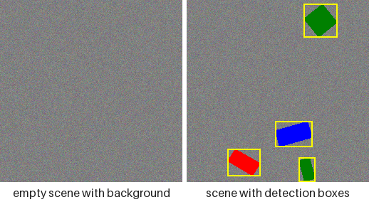

    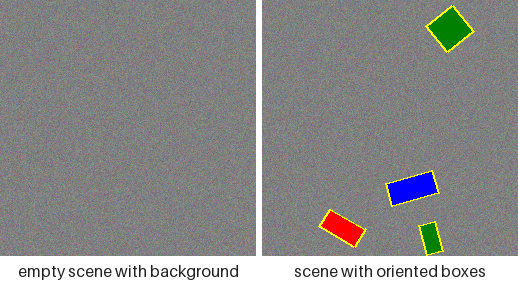

    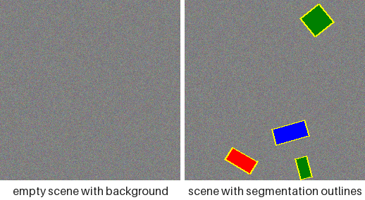

=== "moderate"

    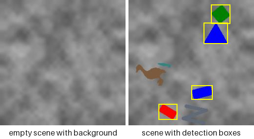

    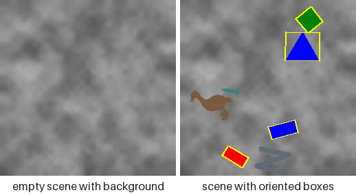

    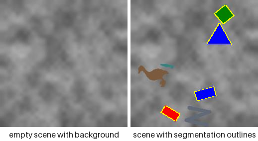

=== "hard"

    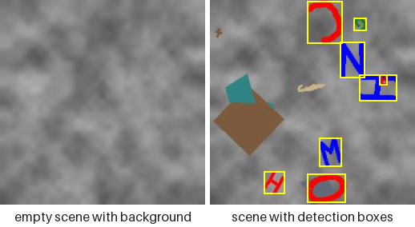

    

    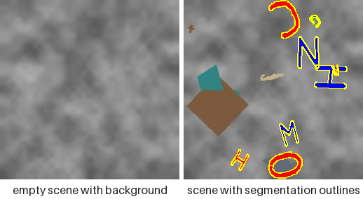

Both halves are rendered at 256 pixels because the bands are size *ratios*: `0.03` of that canvas is the eight-pixel glyph the hard band is named for, and a band rendered smaller would quietly stop being the band in the table. What the pictures show that the numbers cannot is how little of a hard sample is a labelled object — most of its ink is unlabelled clutter drawn by the same process as the targets, over a canvas whose own structure sits at object scale. The overlays are where the band's cost lands unevenly: an eight-pixel glyph still takes a readable box, while its outline and its rotation are most of a stroke wide and effectively unrecoverable. The keypoints task has no tab here because only the hard band's vocabulary carries landmarks — the [tasks page](tasks.md) shows it per family. Regenerate them with `python examples/render_scene_gallery.py --groups difficulty`.

### The knobs a band is made of

A band is nothing but the fields in its row, and each of those is pictured on its own under [Customization and extension](customization.md). Reading a band as its parts is the fastest way to see which part is costing a model what:

=== "the canvas"

    `NoiseBackground(sigma=12)` for easy, `TextureBackground(frequency=8)` for the other two. Grain removes the trivial edge detector; structure at object scale is what makes a false positive possible at all.

    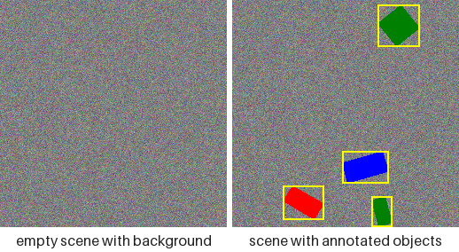

    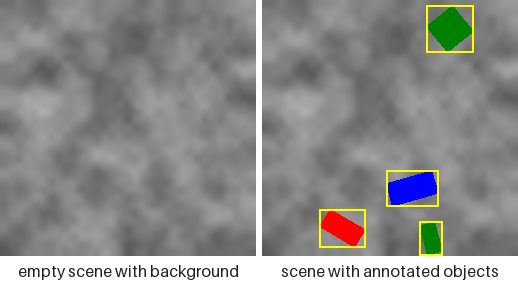

=== "the clutter"

    `distractors=3` for moderate, `distractors=6` for hard. Drawn from the same process as the targets and carrying no annotation, so "is there a shape here" stops being a usable detector — only the boxes separate them.

    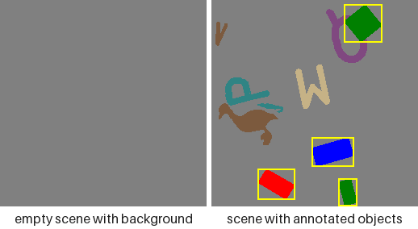

=== "the degradations"

    `degrade=(GaussianBlur(0.5), JPEG(75))` for moderate and hard. Both are shown here at stronger settings than the bands use, so what they do is visible: blur costs corner keypoints and the OBB angle, JPEG costs thin strokes.

    

    

=== "the vocabulary"

    `shapes=tuple(LetterShape)` is what makes the hard band hard at small sizes: 26 classes whose silhouettes differ by a stroke, rather than four whose silhouettes differ by a corner count. The [shape families](shapes.md) page pictures every member.

    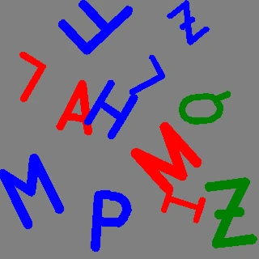

```python
from fuse_augmentations.data import (
    JPEG,
    GaussianBlur,
    SyntheticConfig,
    TextureBackground,
)
from fuse_augmentations.data.letters import LetterShape

hard = SyntheticConfig(
    img_size=256,
    background=TextureBackground(frequency=8.0),
    shapes=tuple(LetterShape),
    min_size_ratio=0.03,
    max_size_ratio=0.25,
    min_objects=4,
    max_objects=8,
    distractors=6,
    degrade=(GaussianBlur(radius=0.5), JPEG(quality=75)),
)

print(len(hard.shapes), hard.distractors, len(hard.degrade))
```

<details>
<summary>The hard band's own numbers</summary>

```
26 6 2
```

</details>

## What ranks them

The ladder is measured in this repository by a **training-free proxy**: five deterministic, numpy-only statistics over a fixed seed, run as part of the unit suite (`tests/test_unit/test_data/_difficulty.py`). Measured over eight images per band on a 256-pixel canvas:

| band     | mean area px | p10 area px | small fraction | boundary contrast | background SNR | clutter |
| -------- | ------------ | ----------- | -------------- | ----------------- | -------------- | ------- |
| easy     | 1652         | 553         | 0.000          | 44.7              | 7.75           | 0.000   |
| moderate | 1263         | 330         | 0.000          | 37.5              | 3.34           | 0.027   |
| hard     | 517          | 30          | 0.298          | 36.9              | 3.20           | 0.041   |

All five axes agree on the ordering, which is not something the table was tuned into — a test asserts it, so a band that stopped being harder than the one below it fails the suite rather than quietly staying on this page. Reading the columns:

- **mean / p10 area** — labelled-object area in pixels, from the polygon rather than the box. The tenth percentile is what says whether a band *reaches* the small regime rather than merely averaging lower.
- **small fraction** — share of objects below COCO's own small-object threshold rescaled to this canvas (`1024 × (256/640)²` ≈ 164 px). Zero for the two easier bands and roughly three objects in ten for the hard one.
- **boundary contrast** — mean absolute grey step across the object outline, which is what a first-layer edge filter actually straddles.
- **background SNR** — object-to-background grey separation divided by the background's own spread: how far a fill stands out in units of the noise around it.
- **clutter** — share of the canvas painted by unlabelled distractors, measured on an undegraded twin of the same seed, since a blurred or compressed fill no longer matches the palette exactly.

Regenerate the table from the code that produced it rather than editing it by hand:

```bash
python -c "from tests.test_unit.test_data._difficulty import render_table; print(render_table())"
```

## What this does not claim

Two limits worth stating outright, because a proxy is easy to over-read:

- It does not rank architectures on real images. A knob that costs 0.05 mAP on drawn shapes may cost nothing, or everything, on photographs.
- It measures the pipeline's sensitivity to each nuisance, which is what a regression gate needs, and nothing about absolute detectability.

A held-out mAP table over these bands remains desirable and belongs downstream in `lucid_yolo`, which already has the training loop and the held-out gate — this package is referenced from its tests and has no training code of its own. `ultralytics` is neither a dependency nor an extra here, and reimplementing a training loop inside a data generator to measure that generator would be the wrong place for it. The follow-up is therefore filed against that gate rather than against this repository.
