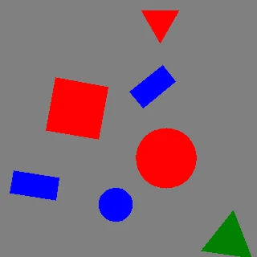

# Tasks and keypoints

## Tasks

Each task exposes a different annotation representation. In the looping previews below (yellow overlay), every generated image appears first bare, then with its exported annotation drawn back on. The clips share the same seeded sample stream, so the shapes line up one-for-one — only the label type differs.

=== "Detection"

    Axis-aligned boxes.

    

=== "Segmentation"

    Filled-shape polygons.

    

=== "OBB"

    Oriented boxes, derived in each shape's own upright frame: the box is the shape's axis-aligned box in its pre-rotation pose, turned rigidly with the shape — its sides always run along and across the shape's own (symmetry) axis, the way a human annotator would draw it, rather than the minimum-area rectangle, which for shapes like `kite` or `arrow` would lean off the shape's axis.

    

=== "Keypoints / pose"

    Animal silhouettes with the sixteen landmark points and skeleton edges.

    

Regenerate these clips with `python examples/animate_synthetic_dataset.py`.

## Coordinate conventions

Each annotation field is in the coordinate space of the transform that moves it, so a generated label can be handed straight to a `FusedCompose` pipeline without a conversion step:

| Field         | Space                                                                            | Moved by              |
| ------------- | -------------------------------------------------------------------------------- | --------------------- |
| `polygon`     | pixel **centre** — pixel `i` is the point `i`                                    | `transform_keypoints` |
| `keypoints`   | pixel **centre** (visible points; a `v=0` placeholder is a flag, not a position) | `transform_keypoints` |
| `obb_corners` | pixel **centre** — derived from `polygon`                                        | `transform_rboxes`    |
| `bbox_xyxy`   | pixel **edge** — a full `(H, W)` canvas spans `[0, W] x [0, H]`                  | `transform_bbox_xyxy` |

The split is not a quirk of the dataset; it mirrors the core, which resamples images and moves point fields on pixel centres while conjugating boxes to pixel edges (see [Known limitations](../known-limitations.md)). The two spaces differ by half a pixel each way, which is invisible under identity and a generic-angle rotation but becomes a **full pixel** under any flip or quarter turn — so a field that travels through the wrong matrix lands one pixel off its own ink.

The rasterizer works in edge space, because Pillow fills pixel `floor(x)` for a vertex at `x`. Adding `0.5` to `polygon` therefore redraws the exact shape that was generated, which is what `tests/test_unit/test_data/test_coordinate_convention.py` asserts pixel for pixel.

**Exported files carry one convention throughout.** Both writers convert the point fields back to edge space at the file boundary, so a COCO record's `segmentation`, `keypoints` and `bbox` are read in a single coordinate system, as COCO and YOLO consumers expect. The split above applies to the in-memory `Annotation` only.

## Recovering a tighter box under rotation

`transform_bbox_xyxy` returns the axis-aligned box of the four warped box corners. That is all it can do with a box as input, and under a rotation the result is looser than the object: the corners sweep a rectangle that includes background the original box never covered.

A segmentation-task sample also carries the outline, so the tighter box can be recovered without any change to the pipeline — warp the polygon and take its extent:

<!--phmdoctest-skip-->

```python
from fuse_augmentations import FusedCompose
from fuse_augmentations.data.geometry import polygon_to_bbox_xyxy, to_pixel_edge

pipeline = FusedCompose(transforms, data_keys=["input", "keypoints"])
warped_image, warped_points = pipeline(image, polygon)
tight_box = polygon_to_bbox_xyxy(to_pixel_edge(warped_points[0].numpy()))
```

`to_pixel_edge` is what puts the result in the same space as `bbox_xyxy` (see [Coordinate conventions](#coordinate-conventions)); skip it and the box is half a pixel off.

Measured against the axis-aligned extent of the rendered ink, over six single-object scenes per family at 192 px under a 37° rotation with scale 0.85:

| Family    | Box through the affine | Box from the warped polygon |
| --------- | ---------------------- | --------------------------- |
| geometric | 0.76                   | 0.98                        |
| symbols   | 0.57                   | 0.97                        |
| animals   | 0.51                   | 0.96                        |
| letters   | 0.83                   | 0.97                        |

How much a box loosens depends on how much of it the object fills, which is why animals — thin limbs, tails — lose most and letters least. Adding 12° of shear does not close the gap. `tests/test_unit/test_data/test_bbox_from_polygon.py` pins the ordering and its size.

`augment_detection_batch` cannot do this for you: it accepts exactly `data_keys=["input", "bbox_xyxy"]` and a `boxes`/`labels` target mapping, so no polygon reaches that boundary. The recipe above lives in caller code.

## Keypoints / pose

The `keypoints` task is available for three shape families, each with its own fixed, dataset-wide schema: the twelve **animal** silhouettes use a 16-point anatomical schema (below), the seven **symbol** shapes use a 7-point structural schema (see [Symbol keypoint schema](#symbol-keypoint-schema)), and the twenty-six **letter** stroke figures use a 15-point grid schema (see [Letter keypoint schema](#letter-keypoint-schema)). A dataset carries exactly one — Ultralytics' YOLO pose format declares one `kpt_shape` and COCO one `keypoints` list per category, so `shapes` must belong entirely to one family under this task; mixing any two of them, or pairing a geometric shape with any of them, raises `ValueError` at `SyntheticConfig` construction.

A single set of animal names covers quadrupeds, birds, and swimmers, because the `front_limb_*` pair is whatever the animal actually has at that slot (paws, wings, or fins/flippers). `left` is the limb nearer the viewer, `right` the far one — a documented convention, since a side profile cannot truly tell left from right. Because the far point sits only slightly offset from the near one (0.8–4.1px apart at shipped instance-size defaults), left/right-paired landmarks are visually indistinguishable at default rendering sizes — worth knowing before writing a custom evaluator or training on this data.

| Index | Name                | Meaning                                                                               |
| ----- | ------------------- | ------------------------------------------------------------------------------------- |
| 1     | `mouth`             | Mouth — snout/beak/trunk tip                                                          |
| 2     | `eye`               | Eye landmark (hand-placed — a silhouette carries no eye)                              |
| 3     | `ear`               | Ear (tip where prominent, else the ear position on the head); **optional**, see below |
| 4     | `head`              | Skull centre                                                                          |
| 5     | `neck`              | Middle of the neck, halfway between head and shoulders                                |
| 6     | `body_top`          | Shoulder/chest — the front-limb attachment region                                     |
| 7     | `body_bottom`       | Hip/pelvis — the hind-limb attachment region                                          |
| 8     | `tail`              | Tail tip                                                                              |
| 9     | `front_elbow_left`  | Near front-limb bend: elbow, wing wrist, or flipper bend                              |
| 10    | `front_elbow_right` | Far front-limb bend; overlaps the near one when not separately visible                |
| 11    | `front_limb_left`   | Near front-limb tip: paw/hoof, wing tip, or fin/flipper tip                           |
| 12    | `front_limb_right`  | Far front limb; overlaps the near one when not separately visible                     |
| 13    | `hind_knee_left`    | Near hind knee/hock bend; **optional**, see below                                     |
| 14    | `hind_knee_right`   | Far hind knee/hock bend; **optional**, see below                                      |
| 15    | `hind_limb_left`    | Near hind-limb tip (foot/hoof); **optional**, see below                               |
| 16    | `hind_limb_right`   | Far hind limb; **optional**, see below                                                |

The skeleton connects `mouth`–`head`, `eye`–`head`, `ear`–`head`, the `head`–`neck`–`body_top`–`body_bottom`–`tail` chain, a two-segment `body_top`–`front_elbow`–`front_limb` chain per front limb, and a two-segment `body_bottom`–`hind_knee`–`hind_limb` chain per hind leg — 15 edges over 16 nodes, so an absent ear drops exactly its one edge and an absent hind leg exactly its own two, orphaning nothing. Every limb is articulated in two points because a limb's bend is the most visible pose cue on a silhouette.

Visibility follows COCO: `v=2` means the point is labeled and visible inside the canvas; `v=0` means it is not labeled, either because it fell outside the canvas or because the animal does not have that landmark at all (see "Absent landmarks" below). A `v=0` point's coordinates are zeroed. Partial occlusion is not modeled.

### Landmarks and the silhouette

Only the **letter** family guarantees that a landmark lies inside the ink. A letter's outline *is* the set of points within half a stroke width of its keypoint skeleton, so every letter keypoint sits strictly inside the fill with half a stroke of clearance, by construction. **Symbol** landmarks are inside because the shapes are convex and their slots are structural. **Animal** landmarks carry no such rule: they are hand-placed against the silhouette, and the placement table in `fuse_augmentations/data/zoo/README.md` defines several of them as *tips* — `tail` is the tail tip, `front_limb_*`/`hind_limb_*` are limb tips. A tip on a tapering appendage sits on the boundary by intent, and at default instance sizes the boundary quantises to the outside: roughly 1% of visible animal landmarks (tails, hind limbs on `kangaroo` and `crocodile`, the `flamingo` eye) round to a pixel just off their own filled polygon, before any augmentation runs.

This matters only for a consumer that *samples* at the landmark — a heatmap target, a mask lookup, an "is this landmark occluded" test. An OKS evaluator is unaffected. If you need the inside-ink property, use the letter family, or test it yourself rather than assuming it.

Every landmark is a pure rigid transform (translate/scale/rotate) of its packaged template position — zero articulation, zero intra-class deformation — so a model trained on this data learns template identity plus a similarity-transform regression, not articulated pose; the dataset exercises the COCO/YOLO pose formats end-to-end, it is not a substitute for articulated-pose training data.

### Occluded landmarks

`v=1` — labelled but not visible — appears only when a run sets `occluders`. An occluder is an unlabelled shape drawn *over* the labelled objects, so a landmark underneath it is still known exactly and simply cannot be seen; it keeps its coordinates and is demoted from `2` to `1` rather than zeroed. A landmark the canvas frame already clipped stays at `0` and is never promoted, since the mask has nothing to say about a point outside the image.

Polygons and boxes are untouched by an occluder, which follows COCO: a polygon describes the object, not the part of it that happens to be visible. The mask a writer rasterizes from that polygon is therefore **amodal**, and `sample.scene.occluder_mask` publishes what was drawn over it so a consumer wanting a modal mask can subtract the two. Without occluders, `scene.occluder_mask` is `None` rather than an all-`False` array, so "none were asked for" stays distinguishable from "some were drawn and missed".

### Absent landmarks

`ear` and the four hind-leg points (`hind_knee_*`, `hind_limb_*`) are the only landmarks an animal may lack — a whale's silhouette shows pectoral flippers (its front limbs) but no hind legs, and neither a whale nor a fish has an external ear to annotate. The packaged table carries a `(nan, nan)` row for an absent landmark rather than a faked point, always paired with `v=0`; every writer branches on that visibility flag, not on the coordinates, so an absent landmark is emitted as the documented `(0.0, 0.0, v=0)` placeholder with no special-casing for NaN. `fish` and `whale` lack all five (11 of 16 landmarks present); the other ten animals have all 16.

An absent landmark and a canvas-clipped landmark both serialize identically as `v=0` (matching COCO's own "not labeled" convention). A custom-eval author computing per-keypoint recall or OKS naively — treating every `v=0` as a detector miss — will see a systematic bias on `fish` and `whale`, whose four hind-leg points are structurally absent rather than missed.

All 49 classes are still emitted as COCO categories, but the keypoint schema and skeleton are attached only to categories in the run's own keypoint family — for an animal run, the four geometric-shape categories carry no `keypoints`/`skeleton` fields, and neither would the seven symbol categories or the twenty-six letter categories if this were a symbol or letter run instead, since none of them has a matching landmark table to draw from. Each animal category stores one flat triple per point on each of its annotations:

```json
{
  "categories": [
    {
      "id": 5,
      "name": "duck",
      "keypoints": ["mouth", "eye", "ear", "head", "neck", "body_top", "body_bottom", "tail", "front_elbow_left", "front_elbow_right", "front_limb_left", "front_limb_right", "hind_knee_left", "hind_knee_right", "hind_limb_left", "hind_limb_right"],
      "skeleton": [[1, 4], [2, 4], [3, 4], [4, 5], [5, 6], [6, 7], [7, 8], [6, 9], [6, 10], [9, 11], [10, 12], [7, 13], [7, 14], [13, 15], [14, 16]]
    }
  ],
  "annotations": [
    {
      "keypoints": [x1, y1, v1, "...", x16, y16, v16],
      "num_keypoints": 16
    }
  ]
}
```

`num_keypoints` counts only `v>0` triples, so a whale's absent ear and hind legs drop it to 11.

YOLO pose labels extend the detection row with the same ordered triples, and `data.yaml` declares the shared shape plus its horizontal-flip mapping:

```yaml
path: .
kpt_shape: [16, 3]
flip_idx: [0, 1, 2, 3, 4, 5, 6, 7, 8, 9, 10, 11, 12, 13, 14, 15]
names:
  0: square
  4: duck
```

`flip_idx` is the identity permutation on purpose: `left`/`right` are viewer-relative here — `left` is the limb nearer the viewer, not the animal's anatomical left — so mirroring a side profile never turns a near limb into a far one and no landmark changes index under a horizontal flip.

Each pose row is `cls cx cy w h x1 y1 v1 ... x16 y16 v16` — 53 tokens, fixed-width even for a whale whose absent hind legs still emit their zeroed `0.000000 0.000000 0` triples. Each animal ships as an editable SVG asset under `fuse_augmentations/data/zoo/<animal>.svg`, carrying its outline, its keypoints (with a visible skeleton overlay), and its CC0/Public Domain Mark provenance as `zoo:`-namespaced attributes; the placement rules and hand-editing instructions live in `fuse_augmentations/data/zoo/README.md`.

### Symbol keypoint schema

The seven symbol shapes share a different, smaller schema: seven generic structural slots rather than sixteen anatomical ones. Where the animals could share names because of anatomical homology (every quadruped has a `body_top`), the symbols have no equivalent shared vocabulary — a "flank" means a kite's side corner on one shape and an arrow's barb on another — so the names describe structural role instead, and only `center` is guaranteed present.

| Index | Name          | Meaning                                                          |
| ----- | ------------- | ---------------------------------------------------------------- |
| 1     | `center`      | The outline's own area centroid (center of mass) — **mandatory** |
| 2     | `apex`        | The distinctive distal point (optional)                          |
| 3     | `tail`        | The point opposite `apex` along the main axis (optional)         |
| 4     | `flank_left`  | Mirrored pair nearest the apex (optional)                        |
| 5     | `flank_right` | Mirrored pair nearest the apex (optional)                        |
| 6     | `base_left`   | Mirrored pair at the far end (optional)                          |
| 7     | `base_right`  | Mirrored pair at the far end (optional)                          |

Point counts run 4–6 across the seven symbols, so — exactly like the animals' absent `ear`/hind-leg rows — an unused slot is a `(nan, nan)` row paired with `v=0`, never a faked point. `center` is each symbol's own area centroid (the shoelace-formula center of mass, computed from its raw outline) rather than a hand-picked point — for every symbol shipped here that centroid lands safely inside the outline, even the concave ones (`arrow`, `cross`, `anchor`), so there is no need to fall back to a hand-placed substitute; a future, more exotic concave outline whose true centroid falls outside its own silhouette would need one.

The skeleton is a **star**: six edges, each connecting `center` to one of the other six slots. Every optional slot is therefore a leaf, so an unused one drops exactly its own edge and orphans nothing — the same property the animal skeleton's `ear`/hind-leg leaves rely on.

Unlike the animals' identity `flip_idx`, the symbol schema's horizontal flip is a genuine, non-trivial permutation: `flank_left` (index 3, 0-based) swaps with `flank_right` (4), and `base_left` (5) swaps with `base_right` (6); `center`/`apex`/`tail` sit on the symmetry axis and map to themselves. This is correct precisely because every symbol is drawn mirror-symmetric about its own vertical axis in canonical orientation — a property a square or a plain plus-sign could not offer (4-fold symmetry gives a fixed landmark no stable identity), but two-fold mirror symmetry does, since the generator's random in-plane rotation preserves winding and so keeps left and right distinguishable at any angle.

```yaml
path: .
kpt_shape: [7, 3]
flip_idx: [0, 1, 2, 4, 3, 6, 5]
names:
  0: square
  16: kite
```

Each symbol pose row is `cls cx cy w h x1 y1 v1 ... x7 y7 v7` — 26 tokens, fixed-width even for a symbol using only 4 of the 7 slots. Each symbol ships as an editable SVG under `fuse_augmentations/data/symbols/<symbol>.svg`, in the same schema the animals use: one closed `<path id="outline">` plus a `<g id="keypoints">` of named circles. The two families store the same thing — an outline and the landmarks annotating it — so they now store it the same way, and `examples/edit_shape_keypoints.py` drags a symbol's landmarks exactly as it drags a duck's.

### Letter keypoint schema

The twenty-six letters share a third, still smaller schema: fifteen generic grid slots — `top_left`, `top_mid`, `top_right`, `upper_left`, `upper_mid`, `upper_right`, `mid_left`, `center`, `mid_right`, `lower_left`, `lower_mid`, `lower_right`, `bottom_left`, `bottom_mid`, `bottom_right` — laid out as one shared 3-column x 5-row grid. Unlike the symbols, no slot is mandatory across every letter (`v`, for instance, never touches `center`); a letter uses whichever subset it needs, so point counts run from 3 (`l`, `v`) to 10 (`b`).

Unlike either other family, a letter's **skeleton is not shared** across the family: each letter's edges are exactly its own stroke graph — the same graph the outline is wrapped around — because that graph *is* what makes it that letter, not a cosmetic overlay on a silhouette every member shares. COCO's per-category `skeleton` and the animated-preview overlay both resolve this per letter rather than reading one dataset-wide tuple.

Unlike the animal and symbol landmarks, which need an inward inset to keep them off their own outline's boundary, a letter's keypoints need no correction at all: they are exactly the nodes the outline was wrapped around, and the wrap leaves every one of them half a stroke width inside the fill — including a stroke's free end, which sits at the center of its own round cap.

The horizontal-flip `flip_idx` swaps each row's left/right slot and holds the middle column fixed. Note that a mirrored letter is generally a different letter (or no letter at all), so a horizontal flip is not the label-preserving augmentation here that it is for an animal silhouette; the field is published for format completeness.

```yaml
path: .
kpt_shape: [15, 3]
flip_idx: [2, 1, 0, 5, 4, 3, 8, 7, 6, 11, 10, 9, 14, 13, 12]
names:
  0: a
  23: x
```

Each letter pose row is `cls cx cy w h x1 y1 v1 ... x15 y15 v15` — 50 tokens, fixed-width even for `i`, which uses only 3 of the 15 slots. Each letter ships as an editable SVG under `fuse_augmentations/data/letters/<letter>.svg`, but in a *graph* schema rather than an outline one: a `<g id="nodes">` of named grid positions and a `<g id="strokes">` of `<line>` edges (optionally curved by `zoo:bulge`, cut by `zoo:cut`). There is no outline in the file — the silhouette is generated by stroking that graph at load time, which is what keeps `LETTER_STROKE_WIDTH` and `LETTER_COUNTER_GAP` tunable after the fact and keeps a node a single draggable point instead of a consequence baked into a hundred outline vertices. `examples/edit_shape_keypoints.py` opens letters too, drawing the strokes themselves so dragging a node visibly reshapes the letter.
