# Synthetic shape datasets

`fuse_augmentations.data` draws colored shapes on a canvas and writes ready-to-train datasets. It is a standalone generation utility: no file-backed dataset loader, no model, no training loop. Use it for pipeline smoke tests, augmentation demos, teaching material, and quick detector sanity checks where a real dataset is overkill.

It supports two output formats — **COCO** and **YOLO** — across four tasks — **detection**, **segmentation**, **oriented bounding box (OBB)**, and **keypoints / pose**.

## Install

Rendering uses [Pillow](https://python-pillow.github.io/), which ships as a base dependency — nothing extra to install:

```bash
pip install fuse-augmentations
```

## Quickstart

```python
import tempfile

from fuse_augmentations import generate_dataset

with tempfile.TemporaryDirectory() as out_dir:
    counts = generate_dataset(
        out_dir,
        num_images=100,
        fmt="coco",
        task="detection",
        class_mode="shape",
        seed=0,
    )

print(counts)
```

<details>
<summary>Per-split image counts</summary>

```
{'train': 70, 'val': 20, 'test': 10}
```

</details>

Pass a real path instead of the temporary directory to keep the dataset. The same call with `fmt="yolo"` writes an Ultralytics-style layout; `generate_dataset` returns the number of images written per split.

## Shapes, colors, and classes

Shapes are drawn on a gray canvas at random positions, sizes, and rotations, in three colors (`red`, `green`, `blue`). The shape vocabulary has four families: four **geometric** shapes (`square`, `rectangle`, `triangle`, `circle`), twelve **animal** silhouettes (`duck`, `elephant`, `giraffe`, `fish`, `rabbit`, `camel`, `eagle`, `penguin`, `whale`, `kangaroo`, `flamingo`, `crocodile` — see [Animal shapes](#animal-shapes)), seven **symbol** shapes (`kite`, `trapezoid`, `house`, `arrow`, `cross`, `teardrop`, `anchor` — see [Symbol shapes](#symbol-shapes)), and twenty-six **letter** stroke figures (`a`–`z` — see [Letter shapes](#letter-shapes)). Only the geometric four are drawn unless you opt in.

### Shape reference

A field-guide-style lookup of every shape and its plain axis-aligned detection box (blue), upright at its own authored orientation exactly as drawn — not sampled from the generator, so no random color, rotation, or `asymmetry_jitter`. Every symbol and animal is authored mirror-symmetric about its own vertical axis, so this is what keeps a reference recognizable: an `arrow` pointing up, a `house` with its roof up, a `kite` on its long axis. The blue box here is the detection box at this fixed reference position — **not** the minimum-area oriented bounding box (see [Tasks](#tasks)) the generator's actually-rotated samples carry; that box is a rotated quadrilateral in general, not always axis-aligned even at this same unrotated pose (the `arrow`'s true minimum-area OBB, for instance, is a diamond flush to its barb tips), and drawing it here at a fixed angle would show one arbitrary rotation rather than the shape itself. Animals, symbols, and letters also show their keypoint schema (dots and skeleton) in orange, matching the animated previews' occluded-keypoint color.

=== "Geometric"

    |                            Reference                            | Shape       | Details                                                                                                                                             |
    | :-------------------------------------------------------------: | ----------- | --------------------------------------------------------------------------------------------------------------------------------------------------- |
    |    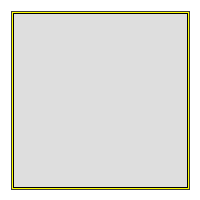    | `square`    | Axis-aligned, 4-fold symmetric — under rotation its OBB stays axis-aligned too.                                                                     |
    | 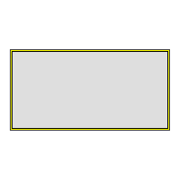 | `rectangle` | Non-square — under rotation its OBB carries real orientation.                                                                                       |
    |  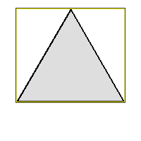  | `triangle`  | Obtuse-scalene, no symmetry at all — the only shape here whose minimum-area OBB is a unique, non-tied minimum under rotation (see [Tasks](#tasks)). |
    |    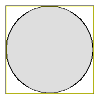    | `circle`    | Rotation-invariant — its OBB collapses to the axis-aligned box at every angle.                                                                      |

=== "Symbols"

    |                           Reference                            | Shape       | Details                                                                                                                                                             |
    | :------------------------------------------------------------: | ----------- | ------------------------------------------------------------------------------------------------------------------------------------------------------------------- |
    |      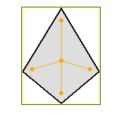      | `kite`      | Diamond with unequal top/bottom diagonals — convex.                                                                                                                 |
    | 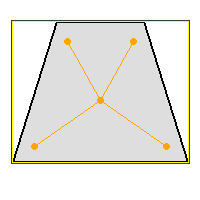 | `trapezoid` | Isosceles trapezoid, short side up — convex.                                                                                                                        |
    |     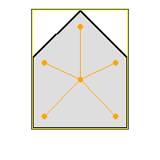     | `house`     | Square body with a triangular roof — convex.                                                                                                                        |
    |     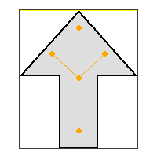     | `arrow`     | Up-pointing arrow with two barbs — concave; under rotation its true minimum-area OBB is a diamond flush to the barb tips, not axis-aligned like the box shown here. |
    |     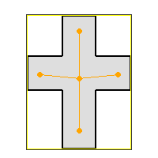     | `cross`     | Latin cross, lower arm longer — concave.                                                                                                                            |
    |  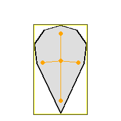  | `teardrop`  | Round top tapering to a bottom point — convex.                                                                                                                      |
    |    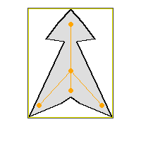    | `anchor`    | Ring, stock, shaft, and two flukes — concave.                                                                                                                       |

=== "Animals"

    |                           Reference                            | Shape       | Details                   |
    | :------------------------------------------------------------: | ----------- | ------------------------- |
    |      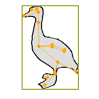      | `duck`      | upright-bird              |
    |  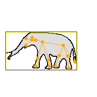  | `elephant`  | bulky-quadruped           |
    |   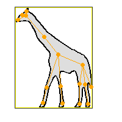   | `giraffe`   | tall-thin                 |
    |      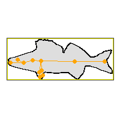      | `fish`      | streamlined               |
    |    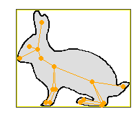    | `rabbit`    | compact-eared             |
    |     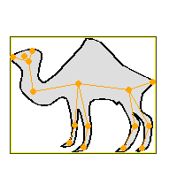     | `camel`     | bulky-quadruped-humped    |
    |     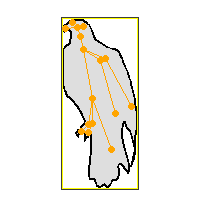     | `eagle`     | upright-bird              |
    |   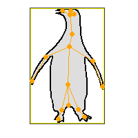   | `penguin`   | upright-bird              |
    |     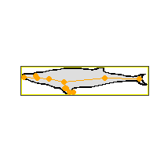     | `whale`     | streamlined-aquatic-large |
    |  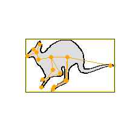  | `kangaroo`  | hopping-marsupial         |
    |  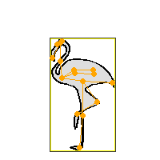  | `flamingo`  | long-legged-wader         |
    | 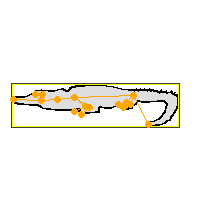 | `crocodile` | sprawling-reptile         |

=== "Letters"

    |                   Reference                    | Shape | Details                                   |
    | :--------------------------------------------: | ----- | ----------------------------------------- |
    | 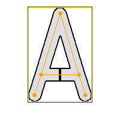 | `a`   | 5 strokes — lambda legs + crossbar        |
    | 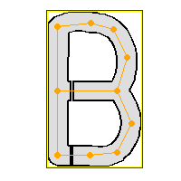 | `b`   | 11 strokes — two bowls off a stem         |
    | 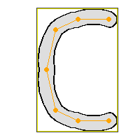 | `c`   | 6 strokes — open ring                     |
    | 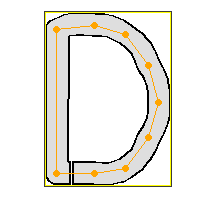 | `d`   | 9 strokes — one bowl off a stem           |
    | 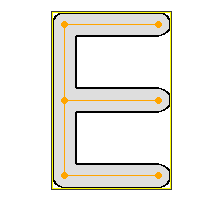 | `e`   | 5 strokes — three bars off a stem         |
    | 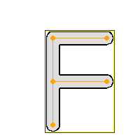 | `f`   | 4 strokes — two bars off a stem           |
    | 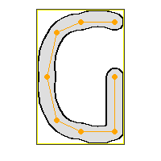 | `g`   | 7 strokes — open ring with an inward hook |
    | 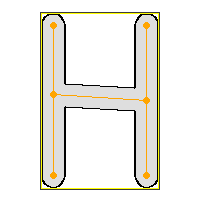 | `h`   | 5 strokes — two verticals + crossbar      |
    | 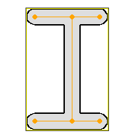 | `i`   | 5 strokes — I-beam, even serifs           |
    | 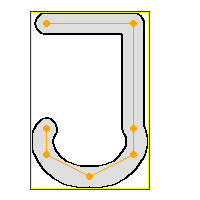 | `j`   | 6 strokes — barred stem with a round hook |
    | 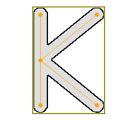 | `k`   | 4 strokes — spine + two diagonals         |
    | 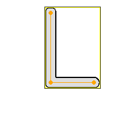 | `l`   | 2 strokes — spine + base bar              |
    | 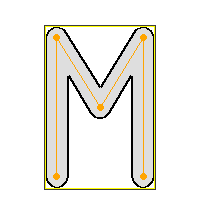 | `m`   | 4 strokes — two verticals + inner V       |
    | 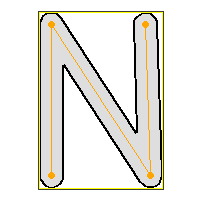 | `n`   | 3 strokes — two verticals + diagonal      |
    | 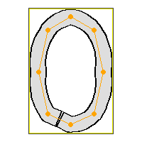 | `o`   | 8 strokes — closed oval ring              |
    | 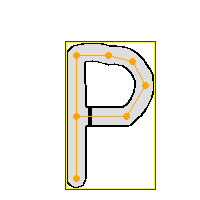 | `p`   | 7 strokes — one upper bowl off a stem     |
    | 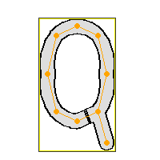 | `q`   | 9 strokes — oval ring + descending tail   |
    | 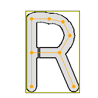 | `r`   | 8 strokes — upper bowl + leg off a stem   |
    | 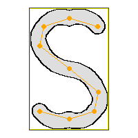 | `s`   | 8 strokes — upright figure-eight          |
    | 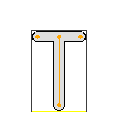 | `t`   | 3 strokes — top bar + stem                |
    | 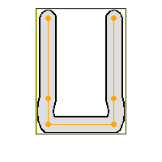 | `u`   | 5 strokes — open-top bowl                 |
    | 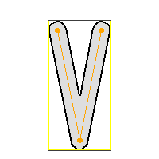 | `v`   | 2 strokes — narrow diagonal pair          |
    | 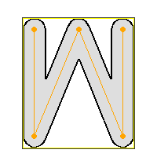 | `w`   | 4 strokes — double V                      |
    | 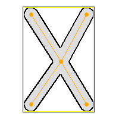 | `x`   | 4 strokes — center + 4 corners            |
    | 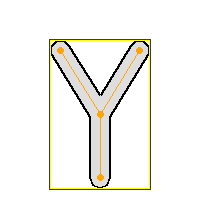 | `y`   | 3 strokes — V + stem                      |
    | 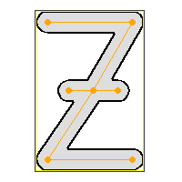 | `z`   | 6 strokes — bar-diagonal-bar, crossed     |

    Nine letters (`b`, `d`, `h`, `i`, `n`, `o`, `s`, `x`, `z`) have one node deliberately placed off the default grid, because their regular block form would be exactly invariant under a 180-degree rotation — see [Letter shapes](#letter-shapes).

Each reference is scaled independently to the largest size that keeps its own outline inside the frame, so a thin shape (the triangle) and a tall one (the giraffe) each fill their own frame rather than sharing one scale sized for the largest shape. Regenerate these with `python examples/render_shape_reference.py` (writes into `docs/assets/shape-references/`, one `<prefix><shape>.png` file per shape; `--families symbols` to regenerate just one family).

`class_mode` selects how object classes are derived:

| `class_mode`  | Classes                                            |
| ------------- | -------------------------------------------------- |
| `shape`       | all 49 shape names, in vocabulary order            |
| `color`       | red, green, blue                                   |
| `shape_color` | Cartesian product, e.g. `red_square` (147 classes) |

The table above lists the full vocabulary; a run narrows it to its own `shapes`. Both the declared classes and the ids stamped on annotations narrow together, so a giraffes-only run declares one class and numbers it `0` — every dataset is internally consistent, and every annotation's id resolves against the `categories` (COCO) or `names` (YOLO) block written beside it. The flip side is that an id means different things in differently-scoped runs, so compare two datasets by class **name**, never by raw id. The `color` mode is the exception that never narrows: no run restricts the color axis of the vocabulary, so red/green/blue keep ids 0/1/2 everywhere.

`rectangle` (non-square) plus a random per-shape rotation give oriented boxes real orientation; a circle is rotation-invariant, so its OBB collapses to the axis-aligned box. Every animal silhouette is asymmetric, so all twelve carry orientation — and so does every symbol and every letter; three of the seven symbols (`arrow`, `cross`, `anchor`) are concave, so their segmentation polygon and OBB carry information an axis-aligned box alone does not — every letter is concave too, one connected outline wrapped around its own keypoint skeleton rather than a hand-authored polygon (see [Letter shapes](#letter-shapes)).

## Animal shapes

Pass `shapes=` (or the CLI's `--shapes animals`) to draw the twelve animal silhouettes instead of the four geometric shapes. Each outline is asymmetric and traced from a CC0 or Public Domain Mark reference silhouette rather than hand-guessed, so every shape stays recognizable and carries real orientation under rotation. Each ships as an editable SVG under `fuse_augmentations/data/zoo/<animal>.svg` — open it in any vector editor or browser to inspect the outline, the keypoints, and the `zoo:`-namespaced provenance attributes (origin, license, attribution).

| Shape       | Archetype                 |
| ----------- | ------------------------- |
| `duck`      | upright-bird              |
| `elephant`  | bulky-quadruped           |
| `giraffe`   | tall-thin                 |
| `fish`      | streamlined               |
| `rabbit`    | compact-eared             |
| `camel`     | bulky-quadruped-humped    |
| `eagle`     | upright-bird              |
| `penguin`   | upright-bird              |
| `whale`     | streamlined-aquatic-large |
| `kangaroo`  | hopping-marsupial         |
| `flamingo`  | long-legged-wader         |
| `crocodile` | sprawling-reptile         |

### Selecting animals

Name the members explicitly, or take the first `N` of them with `tuple(AnimalShape)`:

```python
from fuse_augmentations.data.animals import AnimalShape
from fuse_augmentations.data.config import SyntheticConfig, Task

explicit = SyntheticConfig(
    task=Task.KEYPOINTS, shapes=(AnimalShape.DUCK, AnimalShape.GIRAFFE)
)  # explicit
assert explicit.shapes == (AnimalShape.DUCK, AnimalShape.GIRAFFE)

first_four = SyntheticConfig(
    task=Task.KEYPOINTS, shapes=tuple(AnimalShape)[:4]
)  # duck, elephant, giraffe, fish
assert first_four.shapes == (
    AnimalShape.DUCK,
    AnimalShape.ELEPHANT,
    AnimalShape.GIRAFFE,
    AnimalShape.FISH,
)  # same 4 species every call, per the declaration-order guarantee below

all_animals = SyntheticConfig(
    task=Task.KEYPOINTS, shapes=tuple(AnimalShape)
)  # all twelve
assert len(all_animals.shapes) == 12
```

Slicing `tuple(AnimalShape)` takes a prefix of the declaration order, so the same `n` names the same species on every call — a thirteenth animal could only extend the tail of that list. `shapes` itself is a plain `tuple[Shape, ...]` — where `Shape` is the base class every family's enum derives from, re-exported from [`data.families`](#extending-the-vocabulary) — so `tuple(SymbolShape)` and `tuple(LetterShape)` work identically for the other two keypoint-bearing families (see [Symbol shapes](#symbol-shapes) and [Letter shapes](#letter-shapes)).

All four tasks work on animal shapes; `keypoints` is available for the animal, symbol, and letter families — not the geometric shapes, which have no keypoint tables:

=== "Detection"

    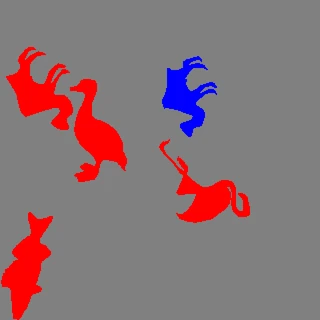

=== "Segmentation"

    

=== "OBB"

    

=== "Keypoints / pose"

    

Regenerate these clips with `python examples/animate_synthetic_dataset.py --shapes animals --task all`.

## Symbol shapes

Pass `shapes=` (or the CLI's `--shapes symbols`) to draw seven analytic 2D symbols instead of the four geometric shapes. Unlike the animals, these are computed from formulas rather than traced from source art — there is no artwork to attribute — but each is still asymmetric enough to keep a real orientation under rotation, and each is drawn mirror-symmetric about its own vertical axis (see [Symbol keypoint schema](#symbol-keypoint-schema)).

| Shape       | Outline                                   | Convex? |
| ----------- | ----------------------------------------- | ------- |
| `kite`      | diamond with unequal top/bottom diagonals | yes     |
| `trapezoid` | isosceles trapezoid, short side up        | yes     |
| `house`     | square body with a triangular roof        | yes     |
| `arrow`     | up-pointing arrow with two barbs          | no      |
| `cross`     | Latin cross, lower arm longer             | no      |
| `teardrop`  | round top tapering to a bottom point      | yes     |
| `anchor`    | ring, stock, shaft, and two flukes        | no      |

There is no plain-triangle symbol: an isosceles triangle both collides in name with the geometric family's `triangle` and, being acute, has a minimum-area OBB with no unique answer (all three candidate edges tie — see [Tasks](#tasks)) — the same problem that motivated redesigning `PrimitiveShape.TRIANGLE` into an obtuse-scalene shape, not worth solving twice for a shape this family does not need to keep. `arrow`, `cross`, and `anchor` are concave, so their segmentation polygon and OBB carry real shape information an axis-aligned box does not.

### Selecting symbols

`tuple(SymbolShape)` mirrors `tuple(AnimalShape)` — name the members explicitly, or take a stable prefix:

```python
from fuse_augmentations.data.config import SyntheticConfig, Task
from fuse_augmentations.data.symbols import SymbolShape

explicit = SyntheticConfig(
    task=Task.KEYPOINTS, shapes=(SymbolShape.KITE, SymbolShape.ANCHOR)
)  # explicit
assert explicit.shapes == (SymbolShape.KITE, SymbolShape.ANCHOR)

first_three = SyntheticConfig(
    task=Task.KEYPOINTS, shapes=tuple(SymbolShape)[:3]
)  # kite, trapezoid, house
assert first_three.shapes == (
    SymbolShape.KITE,
    SymbolShape.TRAPEZOID,
    SymbolShape.HOUSE,
)

all_symbols = SyntheticConfig(
    task=Task.KEYPOINTS, shapes=tuple(SymbolShape)
)  # all seven
assert len(all_symbols.shapes) == 7
```

A dataset can draw from the animal family, the symbol family, or the letter family under `keypoints`, but never more than one at once — see [Symbol keypoint schema](#symbol-keypoint-schema) and [Letter keypoint schema](#letter-keypoint-schema) for why.

=== "Detection"

    

=== "Segmentation"

    

=== "OBB"

    

=== "Keypoints / pose"

    

Regenerate these clips with `python examples/animate_synthetic_dataset.py --shapes symbols --task all`.

## Letter shapes

Pass `shapes=` (or the CLI's `--shapes letters`) to draw twenty-six capital-letter figures (`a`–`z`) instead of the four geometric shapes. Like every other family, a letter is one filled outline polygon — but unlike the hand-authored outlines of `symbols`/`animals`, it is derived. Each letter is authored the way you would sketch one, as a set of **keypoints and the edges between them**, and the drawable shape is produced by wrapping that skeleton in a pen stroke of constant width.

Authoring skeleton-first is what makes the landmarks trustworthy. Because the polygon *is* the set of points within half a stroke width of the skeleton, **every keypoint and every edge between two keypoints lies strictly inside the letter**, with half a stroke width of clearance — a keypoint can never land on the boundary or outside the ink, and a skeleton edge can never cut across empty space. Joining a letter's keypoints in skeleton order therefore sketches that letter *through its own fill*.

Every stroke tip is capped with a semicircle and every convex corner rounded, so no letter has a sharp point anywhere on it; only the concave side of a turn stays angular, where the two strokes' bodies already cover the corner and rounding it would bulge the outline outward across the inside of the turn.

An edge may itself be a shallow circular arc rather than a straight segment, which is what makes `o`/`c`/`g`/`s`'s bowls read as bowls instead of octagons; letters with no curve in a block face (`a e f h i k l m n t v w x y z`) stay straight throughout. How deep an arc may go is bounded by the promise above rather than by taste: the annotated skeleton joins two keypoints with a *straight* line, so an edge bowed far enough for its own chord to leave the stroke is rejected when the asset loads, as is a curved edge that a counter opens on.

Seven letters (`a`, `b`, `d`, `o`, `p`, `q`, `r`) have an enclosed counter. A single polygon ring cannot hold a true hole, so the graph edge that closes each counter's loop is split into two flat-capped stubs separated by a hairline before wrapping — that opens the loop while leaving a slit far too thin to read as a gap, keeping the counter intact (`o`'s hole, `a`'s crossbar pocket) inside one simple, non-self-intersecting ring. Where the slit goes is a letterform decision: a bowl hung off a stem (`b`, `d`, `p`, `r`) breaks on the edge leaving that stem and as near it as fits, so the bowl reads as a curve just touching a vertical line, while a free-standing ring breaks along its bottom — left of centre for `o`, bottom-right for `q` beside where its tail joins. That hairline is the single place in the whole family where a skeleton edge leaves the fill.

The 15 named keypoint slots give every letter the same landmark vocabulary (a fixed count per dataset is a hard requirement of both output formats), and their default coordinates form a regular 3-column x 5-row grid — but a letter is free to place any of its own nodes anywhere, which is what shapes `b`/`d`/`p`/`q`/`r`'s bowls, `o`'s oval, and `q`'s outward tail. Nine letters (`b`, `d`, `h`, `i`, `n`, `o`, `s`, `x`, `z`) also use that freedom to break an exact 180-degree rotational symmetry their regular block form would otherwise carry — the same "look the same upside down" set real handwriting has, and the same kind of fix `SymbolShape.KITE`'s unequal diagonal lengths already make for the symbol family. See the [Letters](#shape-reference) tab above for every letter's stroke count.

### Selecting letters

`tuple(LetterShape)` mirrors `tuple(AnimalShape)`/`tuple(SymbolShape)` — name the members explicitly, or take a stable prefix:

```python
from fuse_augmentations.data.config import SyntheticConfig, Task
from fuse_augmentations.data.letters import LetterShape

explicit = SyntheticConfig(
    task=Task.KEYPOINTS, shapes=(LetterShape.X, LetterShape.O)
)  # explicit
assert explicit.shapes == (LetterShape.X, LetterShape.O)

first_three = SyntheticConfig(
    task=Task.KEYPOINTS, shapes=tuple(LetterShape)[:3]
)  # a, b, c
assert first_three.shapes == (
    LetterShape.A,
    LetterShape.B,
    LetterShape.C,
)

all_letters = SyntheticConfig(
    task=Task.KEYPOINTS, shapes=tuple(LetterShape)
)  # all twenty-six
assert len(all_letters.shapes) == 26
```

All four tasks work on letter shapes, and every output format behaves exactly as it does for the other three families — one `segmentation` ring per COCO annotation, one flat coordinate ring per YOLO-seg row — since a letter is a single polygon like any other shape by the time it reaches a writer.

=== "Detection"

    

=== "Segmentation"

    

=== "OBB"

    

=== "Keypoints / pose"

    

Regenerate these clips with `python examples/animate_synthetic_dataset.py --shapes letters --task all`.

Every clip on this page shows its whole family: the generator picks each object's shape uniformly, so a family preview would otherwise be a lucky subset — twenty-six letters need roughly a hundred drawn objects between them before the last one turns up. Each vocabulary therefore sets its own object count and clip length, and the script then walks its seed forward until the stream it renders really does contain every member, printing the seed it settled on.

## Tasks

Each task exposes a different annotation representation. In the looping previews below (yellow overlay), every generated image appears first bare, then with its exported annotation drawn back on. The clips share the same seeded sample stream, so the shapes line up one-for-one — only the label type differs.

=== "Detection"

    Axis-aligned boxes.

    

=== "Segmentation"

    Filled-shape polygons.

    

=== "OBB"

    Oriented boxes.

    

=== "Keypoints / pose"

    Animal silhouettes with the sixteen landmark points and skeleton edges.

    

Regenerate these clips with `python examples/animate_synthetic_dataset.py`.

## Keypoints / pose

The `keypoints` task is available for three shape families, each with its own fixed, dataset-wide schema: the twelve **animal** silhouettes use a 16-point anatomical schema (below), the seven **symbol** shapes use a 7-point structural schema (see [Symbol keypoint schema](#symbol-keypoint-schema)), and the twenty-six **letter** stroke figures use a 15-point grid schema (see [Letter keypoint schema](#letter-keypoint-schema)). A dataset carries exactly one — Ultralytics' YOLO pose format declares one `kpt_shape` and COCO one `keypoints` list per category, so `shapes` must belong entirely to one family under this task; mixing any two of them, or pairing a geometric shape with any of them, raises `ValueError` at `SyntheticConfig` construction.

A single set of animal names covers quadrupeds, birds, and swimmers, because the `front_limb_*` pair is whatever the animal actually has at that slot (paws, wings, or fins/flippers). `left` is the limb nearer the viewer, `right` the far one — a documented convention, since a side profile cannot truly tell left from right. Because the far point sits only slightly offset from the near one (0.8–4.1px apart at shipped instance-size defaults), left/right-paired landmarks are visually indistinguishable at default rendering sizes — worth knowing before writing a custom evaluator or training on this data.

| Index | Name                | Meaning                                                                               |
| ----- | ------------------- | ------------------------------------------------------------------------------------- |
| 1     | `mouth`             | Mouth — snout/beak/trunk tip                                                          |
| 2     | `eye`               | Eye landmark (hand-placed — a silhouette carries no eye)                              |
| 3     | `ear`               | Ear (tip where prominent, else the ear position on the head); **optional**, see below |
| 4     | `head`              | Skull centre                                                                          |
| 5     | `neck`              | Middle of the neck, halfway between head and shoulders                                |
| 6     | `body_top`          | Shoulder/chest — the front-limb attachment region                                     |
| 7     | `body_bottom`       | Hip/pelvis — the hind-limb attachment region                                          |
| 8     | `tail`              | Tail tip                                                                              |
| 9     | `front_elbow_left`  | Near front-limb bend: elbow, wing wrist, or flipper bend                              |
| 10    | `front_elbow_right` | Far front-limb bend; overlaps the near one when not separately visible                |
| 11    | `front_limb_left`   | Near front-limb tip: paw/hoof, wing tip, or fin/flipper tip                           |
| 12    | `front_limb_right`  | Far front limb; overlaps the near one when not separately visible                     |
| 13    | `hind_knee_left`    | Near hind knee/hock bend; **optional**, see below                                     |
| 14    | `hind_knee_right`   | Far hind knee/hock bend; **optional**, see below                                      |
| 15    | `hind_limb_left`    | Near hind-limb tip (foot/hoof); **optional**, see below                               |
| 16    | `hind_limb_right`   | Far hind limb; **optional**, see below                                                |

The skeleton connects `mouth`–`head`, `eye`–`head`, `ear`–`head`, the `head`–`neck`–`body_top`–`body_bottom`–`tail` chain, a two-segment `body_top`–`front_elbow`–`front_limb` chain per front limb, and a two-segment `body_bottom`–`hind_knee`–`hind_limb` chain per hind leg — 15 edges over 16 nodes, so an absent ear drops exactly its one edge and an absent hind leg exactly its own two, orphaning nothing. Every limb is articulated in two points because a limb's bend is the most visible pose cue on a silhouette.

Visibility follows COCO: `v=2` means the point is labeled and visible inside the canvas; `v=0` means it is not labeled, either because it fell outside the canvas or because the animal does not have that landmark at all (see "Absent landmarks" below). A `v=0` point's coordinates are zeroed. Partial occlusion is not modeled.

Every landmark is a pure rigid transform (translate/scale/rotate) of its packaged template position — zero articulation, zero intra-class deformation — so a model trained on this data learns template identity plus a similarity-transform regression, not articulated pose; the dataset exercises the COCO/YOLO pose formats end-to-end, it is not a substitute for articulated-pose training data.

### Absent landmarks

`ear` and the four hind-leg points (`hind_knee_*`, `hind_limb_*`) are the only landmarks an animal may lack — a whale's silhouette shows pectoral flippers (its front limbs) but no hind legs, and neither a whale nor a fish has an external ear to annotate. The packaged table carries a `(nan, nan)` row for an absent landmark rather than a faked point, always paired with `v=0`; every writer branches on that visibility flag, not on the coordinates, so an absent landmark is emitted as the documented `(0.0, 0.0, v=0)` placeholder with no special-casing for NaN. `fish` and `whale` lack all five (11 of 16 landmarks present); the other ten animals have all 16.

An absent landmark and a canvas-clipped landmark both serialize identically as `v=0` (matching COCO's own "not labeled" convention). A custom-eval author computing per-keypoint recall or OKS naively — treating every `v=0` as a detector miss — will see a systematic bias on `fish` and `whale`, whose four hind-leg points are structurally absent rather than missed.

All 49 classes are still emitted as COCO categories, but the keypoint schema and skeleton are attached only to categories in the run's own keypoint family — for an animal run, the four geometric-shape categories carry no `keypoints`/`skeleton` fields, and neither would the seven symbol categories or the twenty-six letter categories if this were a symbol or letter run instead, since none of them has a matching landmark table to draw from. Each animal category stores one flat triple per point on each of its annotations:

```json
{
  "categories": [
    {
      "id": 5,
      "name": "duck",
      "keypoints": ["mouth", "eye", "ear", "head", "neck", "body_top", "body_bottom", "tail", "front_elbow_left", "front_elbow_right", "front_limb_left", "front_limb_right", "hind_knee_left", "hind_knee_right", "hind_limb_left", "hind_limb_right"],
      "skeleton": [[1, 4], [2, 4], [3, 4], [4, 5], [5, 6], [6, 7], [7, 8], [6, 9], [6, 10], [9, 11], [10, 12], [7, 13], [7, 14], [13, 15], [14, 16]]
    }
  ],
  "annotations": [
    {
      "keypoints": [x1, y1, v1, "...", x16, y16, v16],
      "num_keypoints": 16
    }
  ]
}
```

`num_keypoints` counts only `v>0` triples, so a whale's absent ear and hind legs drop it to 11.

YOLO pose labels extend the detection row with the same ordered triples, and `data.yaml` declares the shared shape plus its horizontal-flip mapping:

```yaml
path: .
kpt_shape: [16, 3]
flip_idx: [0, 1, 2, 3, 4, 5, 6, 7, 8, 9, 10, 11, 12, 13, 14, 15]
names:
  0: square
  4: duck
```

`flip_idx` is the identity permutation on purpose: `left`/`right` are viewer-relative here — `left` is the limb nearer the viewer, not the animal's anatomical left — so mirroring a side profile never turns a near limb into a far one and no landmark changes index under a horizontal flip.

Each pose row is `cls cx cy w h x1 y1 v1 ... x16 y16 v16` — 53 tokens, fixed-width even for a whale whose absent hind legs still emit their zeroed `0.000000 0.000000 0` triples. Each animal ships as an editable SVG asset under `fuse_augmentations/data/zoo/<animal>.svg`, carrying its outline, its keypoints (with a visible skeleton overlay), and its CC0/Public Domain Mark provenance as `zoo:`-namespaced attributes; the placement rules and hand-editing instructions live in `fuse_augmentations/data/zoo/README.md`.

### Symbol keypoint schema

The seven symbol shapes share a different, smaller schema: seven generic structural slots rather than sixteen anatomical ones. Where the animals could share names because of anatomical homology (every quadruped has a `body_top`), the symbols have no equivalent shared vocabulary — a "flank" means a kite's side corner on one shape and an arrow's barb on another — so the names describe structural role instead, and only `center` is guaranteed present.

| Index | Name          | Meaning                                                          |
| ----- | ------------- | ---------------------------------------------------------------- |
| 1     | `center`      | The outline's own area centroid (center of mass) — **mandatory** |
| 2     | `apex`        | The distinctive distal point (optional)                          |
| 3     | `tail`        | The point opposite `apex` along the main axis (optional)         |
| 4     | `flank_left`  | Mirrored pair nearest the apex (optional)                        |
| 5     | `flank_right` | Mirrored pair nearest the apex (optional)                        |
| 6     | `base_left`   | Mirrored pair at the far end (optional)                          |
| 7     | `base_right`  | Mirrored pair at the far end (optional)                          |

Point counts run 4–6 across the seven symbols, so — exactly like the animals' absent `ear`/hind-leg rows — an unused slot is a `(nan, nan)` row paired with `v=0`, never a faked point. `center` is each symbol's own area centroid (the shoelace-formula center of mass, computed from its raw outline) rather than a hand-picked point — for every symbol shipped here that centroid lands safely inside the outline, even the concave ones (`arrow`, `cross`, `anchor`), so there is no need to fall back to a hand-placed substitute; a future, more exotic concave outline whose true centroid falls outside its own silhouette would need one.

The skeleton is a **star**: six edges, each connecting `center` to one of the other six slots. Every optional slot is therefore a leaf, so an unused one drops exactly its own edge and orphans nothing — the same property the animal skeleton's `ear`/hind-leg leaves rely on.

Unlike the animals' identity `flip_idx`, the symbol schema's horizontal flip is a genuine, non-trivial permutation: `flank_left` (index 3, 0-based) swaps with `flank_right` (4), and `base_left` (5) swaps with `base_right` (6); `center`/`apex`/`tail` sit on the symmetry axis and map to themselves. This is correct precisely because every symbol is drawn mirror-symmetric about its own vertical axis in canonical orientation — a property a square or a plain plus-sign could not offer (4-fold symmetry gives a fixed landmark no stable identity), but two-fold mirror symmetry does, since the generator's random in-plane rotation preserves winding and so keeps left and right distinguishable at any angle.

```yaml
path: .
kpt_shape: [7, 3]
flip_idx: [0, 1, 2, 4, 3, 6, 5]
names:
  0: square
  16: kite
```

Each symbol pose row is `cls cx cy w h x1 y1 v1 ... x7 y7 v7` — 26 tokens, fixed-width even for a symbol using only 4 of the 7 slots. Each symbol ships as an editable SVG under `fuse_augmentations/data/symbols/<symbol>.svg`, in the same schema the animals use: one closed `<path id="outline">` plus a `<g id="keypoints">` of named circles. The two families store the same thing — an outline and the landmarks annotating it — so they now store it the same way, and `examples/edit_shape_keypoints.py` drags a symbol's landmarks exactly as it drags a duck's.

### Letter keypoint schema

The twenty-six letters share a third, still smaller schema: fifteen generic grid slots — `top_left`, `top_mid`, `top_right`, `upper_left`, `upper_mid`, `upper_right`, `mid_left`, `center`, `mid_right`, `lower_left`, `lower_mid`, `lower_right`, `bottom_left`, `bottom_mid`, `bottom_right` — laid out as one shared 3-column x 5-row grid. Unlike the symbols, no slot is mandatory across every letter (`v`, for instance, never touches `center`); a letter uses whichever subset it needs, so point counts run from 3 (`l`, `v`) to 10 (`b`).

Unlike either other family, a letter's **skeleton is not shared** across the family: each letter's edges are exactly its own stroke graph — the same graph the outline is wrapped around — because that graph *is* what makes it that letter, not a cosmetic overlay on a silhouette every member shares. COCO's per-category `skeleton` and the animated-preview overlay both resolve this per letter rather than reading one dataset-wide tuple.

Unlike the animal and symbol landmarks, which need an inward inset to keep them off their own outline's boundary, a letter's keypoints need no correction at all: they are exactly the nodes the outline was wrapped around, and the wrap leaves every one of them half a stroke width inside the fill — including a stroke's free end, which sits at the center of its own round cap.

The horizontal-flip `flip_idx` swaps each row's left/right slot and holds the middle column fixed. Note that a mirrored letter is generally a different letter (or no letter at all), so a horizontal flip is not the label-preserving augmentation here that it is for an animal silhouette; the field is published for format completeness.

```yaml
path: .
kpt_shape: [15, 3]
flip_idx: [2, 1, 0, 5, 4, 3, 8, 7, 6, 11, 10, 9, 14, 13, 12]
names:
  0: a
  23: x
```

Each letter pose row is `cls cx cy w h x1 y1 v1 ... x15 y15 v15` — 50 tokens, fixed-width even for `i`, which uses only 3 of the 15 slots. Each letter ships as an editable SVG under `fuse_augmentations/data/letters/<letter>.svg`, but in a *graph* schema rather than an outline one: a `<g id="nodes">` of named grid positions and a `<g id="strokes">` of `<line>` edges (optionally curved by `zoo:bulge`, cut by `zoo:cut`). There is no outline in the file — the silhouette is generated by stroking that graph at load time, which is what keeps `LETTER_STROKE_WIDTH` and `LETTER_COUNTER_GAP` tunable after the fact and keeps a node a single draggable point instead of a consequence baked into a hundred outline vertices. `examples/edit_shape_keypoints.py` opens letters too, drawing the strokes themselves so dragging a node visibly reshapes the letter.

## COCO output

Layout (Roboflow-style, one JSON per split):

```text
shapes_coco/
  train/
    img_000000.jpg
    img_000001.jpg
    _annotations.coco.json
  val/  …
  test/ …
```

`_annotations.coco.json` follows the standard COCO object-detection schema. Category ids are **1-based**:

```json
{
  "info": { "description": "fuse-augmentations synthetic dataset" },
  "licenses": [],
  "categories": [
    { "id": 1, "name": "square", "supercategory": "none" },
    { "id": 2, "name": "rectangle", "supercategory": "none" }
  ],
  "images": [
    { "id": 0, "file_name": "img_000000.jpg", "width": 640, "height": 640 }
  ],
  "annotations": [
    {
      "id": 1,
      "image_id": 0,
      "category_id": 3,
      "bbox": [x, y, w, h],
      "area": 902.0,
      "iscrowd": 0
    }
  ]
}
```

Per task:

- **detection** — `bbox` `[x, y, w, h]` and `area`; no `segmentation` key.
- **segmentation** — adds `"segmentation": [[x1, y1, x2, y2, …]]`, the filled-shape polygon.
- **obb** — stores the four oriented-box corners as a 4-point `"segmentation": [[x1, y1, x2, y2, x3, y3, x4, y4]]` alongside the axis-aligned `bbox`. COCO has no native oriented-box field, so the corner polygon is the OBB carrier.

All coordinates are in pixels and clamped to the image extent.

## YOLO output

Layout (Ultralytics-style):

```text
shapes_yolo/
  images/{train,val,test}/img_000000.jpg
  labels/{train,val,test}/img_000000.txt
  data.yaml
```

`data.yaml` lists only the splits that were written:

```yaml
path: .
train: images/train
val: images/val
test: images/test
nc: 4
names:
  0: square
  1: rectangle
  2: triangle
  3: circle
```

Each label file has one row per object. Class ids are **0-based**; all coordinates are normalized to `[0, 1]` and clamped:

| Task           | Row format                                                                                        |
| -------------- | ------------------------------------------------------------------------------------------------- |
| `detection`    | `cls cx cy w h`                                                                                   |
| `segmentation` | `cls x1 y1 x2 y2 … xn yn`                                                                         |
| `obb`          | `cls x1 y1 x2 y2 x3 y3 x4 y4`                                                                     |
| `keypoints`    | `cls cx cy w h` + one `x y v` triple per schema landmark (53 tokens animal, 26 symbol, 50 letter) |

Example detection rows (`labels/train/img_000000.txt`):

```text
2 0.512000 0.334000 0.180000 0.210000
0 0.744000 0.618000 0.150000 0.150000
```

## In-memory streaming and training feed

Generation and writing are decoupled: `SyntheticGenerator` produces `Sample` objects, and writers persist them. Image **pixels** always stream: when you iterate `SyntheticGenerator` or drive a writer directly, only one `Sample` is materialized at a time, so you can feed a training loop with no disk round-trip and generation never holds more than one image in memory. This one-sample guarantee covers direct generator and writer iteration only — wrapping the source in a batching or multi-worker `DataLoader` (see below) is the exception. Label bookkeeping depends on the format: the YOLO writer emits one label file per image and the in-memory `SyntheticIterableDataset` retains nothing, so both stay memory-bounded regardless of `num_images`. The COCO writer emits a single JSON document per split, so it retains lightweight per-image and per-annotation metadata records (no pixels) in memory — O(n) in the split's image and annotation counts — until that split is written.

Iterate samples directly (no I/O):

```python
# phmdoctest:skip
import numpy as np
from fuse_augmentations.data import SyntheticConfig, SyntheticGenerator

gen = SyntheticGenerator(SyntheticConfig(img_size=256))
for sample in gen.generate(1000, seed=0):  # lazy: one Sample at a time
    train_step(sample.image, sample.annotations)
```

Or plug straight into a PyTorch `DataLoader` via `SyntheticIterableDataset` (exported from `data.datasets`). Because object annotations are ragged (a variable number per image), pass a custom `collate_fn`; each batch is then a `list[Sample]`:

```python
from torch.utils.data import DataLoader

from fuse_augmentations.data import SyntheticIterableDataset

ds = SyntheticIterableDataset(num_images=8, img_size=64, class_mode="shape", seed=0)
loader = DataLoader(ds, batch_size=4, collate_fn=list)

print(sum(len(batch) for batch in loader))
```

<details>
<summary>Total samples yielded across the DataLoader batches</summary>

```
8
```

</details>

Set `num_workers>0` for multi-process loading: `SyntheticIterableDataset` is worker-shard aware, so each worker generates a disjoint, deterministically-seeded slice of `num_images`. Note that a `DataLoader` relaxes the one-sample bound: a batch materializes up to `batch_size` samples at once, prefetching holds `prefetch_factor` batches per worker, and each of `num_workers` workers materializes its own sample concurrently — so in-memory peak scales with `batch_size × num_workers`, not with a single image. When writing to disk, `generate_dataset` streams the same single sample source through per-split views, so image pixels never accumulate; peak memory then depends on the writer — bounded for YOLO, and O(n) COCO metadata (per the note above) for COCO.

## Reproducibility and tuning

Pass `seed=` for byte-identical output; all randomness flows through a single `numpy.random.Generator`. Tune content through `generate_dataset(**config_kwargs)` or a full `SyntheticConfig`:

```python
import tempfile

from fuse_augmentations.data import SplitRatios, generate_dataset

with tempfile.TemporaryDirectory() as out_dir:
    counts = generate_dataset(
        out_dir,
        num_images=200,
        fmt="yolo",
        task="obb",
        split_ratios=SplitRatios(train=0.8, val=0.2, test=0.0),
        img_size=64,
        max_objects=15,
        seed=42,
    )

print(counts)
```

<details>
<summary>Per-split image counts for the 80/20 OBB split</summary>

```
{'train': 160, 'val': 40}
```

</details>

`SyntheticConfig` knobs: `img_size`, `min_objects`/`max_objects`, `min_size_ratio`/`max_size_ratio`, `overlap_iou`, `boundary_tolerance`, `rotate`, `asymmetry_jitter`, `background`, `class_mode`, `task`, `shapes`, `colors`. Overlapping candidates (IoU above `overlap_iou`) and out-of-bounds candidates (more than `boundary_tolerance` outside the frame) are rejected during placement.

`task` and `class_mode` are config fields only. `generate_dataset` takes no `task=` argument of its own — pass it as a keyword and it flows into the config, or set it on a `SyntheticConfig` you build yourself, but not both. Earlier releases accepted it in both places and cross-checked them, which meant a `None` sentinel, a conflict error, and a paragraph explaining which one won; one owner removes all three.

### Breaking left/right symmetry

Most shapes are drawn mirror-symmetric about their own vertical axis in canonical orientation (every geometric shape but the obtuse-scalene `triangle`, every symbol, most letters), so their oriented bounding box otherwise always shows identical left/right margins — real oriented objects (vehicles, ships) rarely are. `asymmetry_jitter` (default `0.0`, a fraction in `[0, 0.5)`) narrows a randomly chosen half — left or right of that axis, before rotation — of each placed object by up to that fraction, independently per instance. The animal silhouettes and roughly two-thirds of the letters are already asymmetric on their own (a letter's own strokes rarely balance left-right the way a symbol's outline is authored to), so the jitter is redundant orientation variety for them rather than the sole source of it — it still applies uniformly to every shape but `circle`, which is excluded for the separate reason below:

```pycon
>>> from fuse_augmentations.data.config import SyntheticConfig
>>> SyntheticConfig(asymmetry_jitter=0.15).asymmetry_jitter
0.15

```

`circle` is always excluded — it never rotates either, so an unrotated skew would bias every circle toward the same absolute image direction instead of varying with a random orientation. Under `Task.KEYPOINTS` the same draw skews the polygon and the landmark table together, so a shape and its keypoints never drift apart. `0.0` (the default) draws exactly the RNG sequence this package always has, so existing seeded configurations are unaffected.

### Custom splits

`SplitRatios` names train/val/test because that is what almost every caller wants, not because the set is closed. `SplitRatios.custom` takes any names at all:

```python
from fuse_augmentations.data import SplitRatios

holdout = SplitRatios.custom({"train": 0.6, "calib": 0.2, "test": 0.2})
print(holdout.to_dict())
```

<details>
<summary>Custom split fractions</summary>

```
{'train': 0.6, 'calib': 0.2, 'test': 0.2}
```

</details>

The arithmetic is unchanged: fractions must be non-negative and sum to 1, or construction raises.

### Custom fill colors

`colors` accepts a named `Color`, any 8-bit `(r, g, b)` triple, or an explicit `Fill`. All three are normalized to `Fill` at construction, so `config.colors` reads back as `Fill` objects whichever spelling went in — the same one-type-inside rule `task` and `class_mode` already follow.

A `Fill` carries the RGB to draw with and, when it came from a named `Color`, that name. A raw triple has no name, so `Fill.label` falls back to the hex value — which is what keeps class naming well defined under `ClassMode.COLOR` and `ClassMode.SHAPE_COLOR` without inventing color names:

```python
from fuse_augmentations.data import (
    ClassMode,
    Color,
    DEFAULT_SHAPES,
    SyntheticConfig,
    class_names,
)

gold = SyntheticConfig(colors=((255, 215, 0), Color.RED))
print([fill.label for fill in gold.colors])
print(class_names(ClassMode.SHAPE_COLOR, DEFAULT_SHAPES, gold.colors)[:2])
```

<details>
<summary>Class names for a custom fill</summary>

```
['ffd700', 'red']
['ffd700_square', 'red_square']
```

</details>

## Extending the vocabulary

Every shape family — the analytic primitives, the animals, the symbols, the letters — is registered once in `fuse_augmentations.data.families`, and every other module reads that registry rather than naming the families itself:

```python
from fuse_augmentations.data import SHAPE_FAMILIES, family_of
from fuse_augmentations.data.animals import AnimalShape

print(
    [
        (family.name, len(family.members), family.has_keypoints)
        for family in SHAPE_FAMILIES
    ]
)
print(family_of(AnimalShape.DUCK).name)
```

<details>
<summary>The registered families</summary>

```
[('primitives', 4, False), ('animals', 12, True), ('symbols', 7, True), ('letters', 26, True)]
animals
```

</details>

A `ShapeFamily` carries its members, an outline accessor, and — for a keypoint-bearing family — its schema and landmark placer. Adding a fifth family means writing the module and appending one entry: the enum derives from `ShapeEnum`, so `Shape` covers it with no second edit. It used to mean editing six places that each encoded the family list differently, where missing one failed quietly: forget the landmark dispatch and the family generated no keypoints at all, which the writer then serialized as a structurally valid all-zero table.

### Registering an output format

`OutputFormat` is a closed enum, but the writer table behind it is not. `register_writer` accepts any key, and `generate_dataset(fmt=...)` will then resolve it:

```python
from fuse_augmentations.data import (
    ClassMode,
    DEFAULT_SHAPES,
    Task,
    YoloWriter,
    class_vocabulary,
    get_writer,
    register_writer,
)


class UltralyticsWriter(YoloWriter):
    """A YOLO writer with house conventions layered on."""


register_writer("ultralytics", UltralyticsWriter)

vocabulary = class_vocabulary(ClassMode.SHAPE, DEFAULT_SHAPES)
writer = get_writer("ultralytics", Task.DETECTION, vocabulary)
print(type(writer).__name__)
```

<details>
<summary>The registered writer</summary>

```
UltralyticsWriter
```

</details>

### Editing the packaged assets

All three asset-backed families are read by one parser (`fuse_augmentations.data.svgio`) and edited by one tool:

```bash
python examples/edit_shape_keypoints.py duck      # an animal silhouette
python examples/edit_shape_keypoints.py anchor    # a symbol outline
python examples/edit_shape_keypoints.py r         # a letter stroke graph
```

Press and hold a point to drag it, release to drop, `s` to save back into the SVG, `q` to quit. Saving rewrites the point group and everything derived from it — an outline family's skeleton, a letter's stroke and cut coordinates — so the file always renders as what it loads as.

## End-to-end example

`examples/generate_synthetic_dataset.py` writes every format × task combination and prints the per-split counts:

```bash
python examples/generate_synthetic_dataset.py --outdir shapes_out --num-images 50 --seed 0
```
