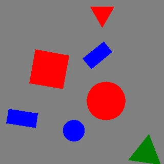

# Synthetic shape datasets

`fuse_augmentations.data` draws colored shapes on a canvas and writes ready-to-train datasets. It is a standalone generation utility: no file-backed dataset loader, no model, no training loop. Use it for pipeline smoke tests, augmentation demos, teaching material, and quick detector sanity checks where a real dataset is overkill.

It supports two output formats — **COCO** and **YOLO** — across four tasks — **detection**, **segmentation**, **oriented bounding box (OBB)**, and **keypoints / pose**.

## Install

Rendering uses [Pillow](https://python-pillow.github.io/), which ships as a base dependency — nothing extra to install:

```bash
pip install fuse-augmentations
```

## Quickstart

```python
import tempfile

from fuse_augmentations import generate_dataset

with tempfile.TemporaryDirectory() as out_dir:
    counts = generate_dataset(
        out_dir,
        num_images=100,
        fmt="coco",
        task="detection",
        class_mode="shape",
        seed=0,
    )

print(counts)
```

<details>
<summary>Per-split image counts</summary>

```
{'train': 70, 'val': 20, 'test': 10}
```

</details>

Pass a real path instead of the temporary directory to keep the dataset. The same call with `fmt="yolo"` writes an Ultralytics-style layout; `generate_dataset` returns the number of images written per split.

## Shapes, colors, and classes

Shapes are drawn on a gray canvas at random positions, sizes, and rotations, in three colors (`red`, `green`, `blue`). The shape vocabulary has two families: four **geometric** shapes (`square`, `rectangle`, `triangle`, `circle`) and eight **animal** silhouettes (`duck`, `snail`, `elephant`, `giraffe`, `fish`, `turtle`, `snake`, `rabbit` — see [Animal shapes](#animal-shapes)). Only the geometric four are drawn unless you opt in.

`class_mode` selects how object classes are derived:

| `class_mode`  | Classes                                           |
| ------------- | ------------------------------------------------- |
| `shape`       | all 12 shape names, in vocabulary order           |
| `color`       | red, green, blue                                  |
| `shape_color` | Cartesian product, e.g. `red_square` (36 classes) |

The class vocabulary always spans the full shape enum, independently of which shapes a run actually draws. A class id therefore means the same thing in every dataset: a giraffes-only run still declares all 12 shape classes and uses giraffe's id rather than renumbering it to `0`.

`rectangle` (non-square) plus a random per-shape rotation give oriented boxes real orientation; a circle is rotation-invariant, so its OBB collapses to the axis-aligned box. Every animal silhouette is asymmetric, so all eight carry orientation.

## Animal shapes

Pass `shapes=` (or the CLI's `--shapes animals`) to draw the eight animal silhouettes instead of the four geometric shapes. Each outline is asymmetric and traced from a CC0 reference silhouette rather than hand-guessed, so every shape stays recognizable and carries real orientation under rotation (see `fuse_augmentations.data.animal_shapes` for provenance per animal).

| Shape      | Archetype       |
| ---------- | --------------- |
| `duck`     | compact-organic |
| `snail`    | compact-round   |
| `elephant` | bulky           |
| `giraffe`  | tall-thin       |
| `fish`     | streamlined     |
| `turtle`   | flat-round      |
| `snake`    | elongated-thin  |
| `rabbit`   | compact-eared   |

All four tasks work on animal shapes; `keypoints` is animal-only (the geometric shapes have no keypoint tables):

=== "Detection"

    

=== "Segmentation"

    

=== "OBB"

    

=== "Keypoints / pose"

    

Regenerate these clips with `python examples/animate_synthetic_dataset.py --shapes animals --task all`.

## Tasks

Each task exposes a different annotation representation. In the looping previews below (yellow overlay), every generated image appears first bare, then with its exported annotation drawn back on. The clips share the same seeded sample stream, so the shapes line up one-for-one — only the label type differs.

=== "Detection"

    Axis-aligned boxes.

    

=== "Segmentation"

    Filled-shape polygons.

    

=== "OBB"

    Oriented boxes.

    

=== "Keypoints / pose"

    Animal silhouettes with the five landmark points and skeleton edges.

    

Regenerate these clips with `python examples/animate_synthetic_dataset.py`.

## Keypoints / pose

The `keypoints` task is available for the eight animal silhouettes and uses one fixed, dataset-wide schema in this order:

| Index | Name   | Meaning                                                                           |
| ----- | ------ | --------------------------------------------------------------------------------- |
| 1     | `head` | Head landmark                                                                     |
| 2     | `eye`  | Eye landmark                                                                      |
| 3     | `back` | Back landmark                                                                     |
| 4     | `tail` | Tail landmark                                                                     |
| 5     | `foot` | Lowest ventral or locomotion point; for legless animals this is not a literal leg |

Visibility follows COCO: `v=2` means the point is labeled and visible inside the canvas; `v=0` means it is not labeled because it fell outside the canvas, and its coordinates are zeroed. Partial occlusion is not modeled.

COCO adds the keypoint schema and skeleton to each category, then stores one flat triple per point on each annotation:

```json
{
  "categories": [
    {
      "id": 5,
      "name": "duck",
      "keypoints": ["head", "eye", "back", "tail", "foot"],
      "skeleton": [[1, 2], [1, 3], [3, 4], [3, 5]]
    }
  ],
  "annotations": [
    {
      "keypoints": [x1, y1, v1, x2, y2, v2, x3, y3, v3, x4, y4, v4, x5, y5, v5],
      "num_keypoints": 5
    }
  ]
}
```

YOLO pose labels extend the detection row with the same ordered triples, and `data.yaml` declares the shared shape:

```yaml
path: .
kpt_shape: [5, 3]
names:
  0: square
  4: duck
```

Each pose row is `cls cx cy w h x1 y1 v1 ... x5 y5 v5`. The keypoint tables are packaged JSON assets under `fuse_augmentations/data/zoo/`; each file records its CC0 source in the `source` field.

## COCO output

Layout (Roboflow-style, one JSON per split):

```text
shapes_coco/
  train/
    img_000000.jpg
    img_000001.jpg
    _annotations.coco.json
  val/  …
  test/ …
```

`_annotations.coco.json` follows the standard COCO object-detection schema. Category ids are **1-based**:

```json
{
  "info": { "description": "fuse-augmentations synthetic dataset" },
  "licenses": [],
  "categories": [
    { "id": 1, "name": "square", "supercategory": "none" },
    { "id": 2, "name": "rectangle", "supercategory": "none" }
  ],
  "images": [
    { "id": 0, "file_name": "img_000000.jpg", "width": 640, "height": 640 }
  ],
  "annotations": [
    {
      "id": 1,
      "image_id": 0,
      "category_id": 3,
      "bbox": [x, y, w, h],
      "area": 902.0,
      "iscrowd": 0
    }
  ]
}
```

Per task:

- **detection** — `bbox` `[x, y, w, h]` and `area`; no `segmentation` key.
- **segmentation** — adds `"segmentation": [[x1, y1, x2, y2, …]]`, the filled-shape polygon.
- **obb** — stores the four oriented-box corners as a 4-point `"segmentation": [[x1, y1, x2, y2, x3, y3, x4, y4]]` alongside the axis-aligned `bbox`. COCO has no native oriented-box field, so the corner polygon is the OBB carrier.

All coordinates are in pixels and clamped to the image extent.

## YOLO output

Layout (Ultralytics-style):

```text
shapes_yolo/
  images/{train,val,test}/img_000000.jpg
  labels/{train,val,test}/img_000000.txt
  data.yaml
```

`data.yaml` lists only the splits that were written:

```yaml
path: .
train: images/train
val: images/val
test: images/test
nc: 4
names:
  0: square
  1: rectangle
  2: triangle
  3: circle
```

Each label file has one row per object. Class ids are **0-based**; all coordinates are normalized to `[0, 1]` and clamped:

| Task           | Row format                    |
| -------------- | ----------------------------- |
| `detection`    | `cls cx cy w h`               |
| `segmentation` | `cls x1 y1 x2 y2 … xn yn`     |
| `obb`          | `cls x1 y1 x2 y2 x3 y3 x4 y4` |

Example detection rows (`labels/train/img_000000.txt`):

```text
2 0.512000 0.334000 0.180000 0.210000
0 0.744000 0.618000 0.150000 0.150000
```

## In-memory streaming and training feed

Generation and writing are decoupled: `SyntheticGenerator` produces `Sample` objects, and writers persist them. Image **pixels** always stream: when you iterate `SyntheticGenerator` or drive a writer directly, only one `Sample` is materialized at a time, so you can feed a training loop with no disk round-trip and generation never holds more than one image in memory. This one-sample guarantee covers direct generator and writer iteration only — wrapping the source in a batching or multi-worker `DataLoader` (see below) is the exception. Label bookkeeping depends on the format: the YOLO writer emits one label file per image and the in-memory `SyntheticIterableDataset` retains nothing, so both stay memory-bounded regardless of `num_images`. The COCO writer emits a single JSON document per split, so it retains lightweight per-image and per-annotation metadata records (no pixels) in memory — O(n) in the split's image and annotation counts — until that split is written.

Iterate samples directly (no I/O):

```python
# phmdoctest:skip
import numpy as np
from fuse_augmentations.data import SyntheticConfig, SyntheticGenerator

gen = SyntheticGenerator(SyntheticConfig(img_size=256))
for sample in gen.generate(1000, seed=0):  # lazy: one Sample at a time
    train_step(sample.image, sample.annotations)
```

Or plug straight into a PyTorch `DataLoader` via `SyntheticIterableDataset` (exported from `data.datasets`). Because object annotations are ragged (a variable number per image), pass a custom `collate_fn`; each batch is then a `list[Sample]`:

```python
from torch.utils.data import DataLoader

from fuse_augmentations.data import SyntheticIterableDataset

ds = SyntheticIterableDataset(num_images=8, img_size=64, class_mode="shape", seed=0)
loader = DataLoader(ds, batch_size=4, collate_fn=list)

print(sum(len(batch) for batch in loader))
```

<details>
<summary>Total samples yielded across the DataLoader batches</summary>

```
8
```

</details>

Set `num_workers>0` for multi-process loading: `SyntheticIterableDataset` is worker-shard aware, so each worker generates a disjoint, deterministically-seeded slice of `num_images`. Note that a `DataLoader` relaxes the one-sample bound: a batch materializes up to `batch_size` samples at once, prefetching holds `prefetch_factor` batches per worker, and each of `num_workers` workers materializes its own sample concurrently — so in-memory peak scales with `batch_size × num_workers`, not with a single image. When writing to disk, `generate_dataset` streams the same single sample source through per-split views, so image pixels never accumulate; peak memory then depends on the writer — bounded for YOLO, and O(n) COCO metadata (per the note above) for COCO.

## Reproducibility and tuning

Pass `seed=` for byte-identical output; all randomness flows through a single `numpy.random.Generator`. Tune content through `generate_dataset(**config_kwargs)` or a full `SyntheticConfig`:

```python
import tempfile

from fuse_augmentations.data import SplitRatios, generate_dataset

with tempfile.TemporaryDirectory() as out_dir:
    counts = generate_dataset(
        out_dir,
        num_images=200,
        fmt="yolo",
        task="obb",
        split_ratios=SplitRatios(train=0.8, val=0.2, test=0.0),
        img_size=64,
        max_objects=15,
        seed=42,
    )

print(counts)
```

<details>
<summary>Per-split image counts for the 80/20 OBB split</summary>

```
{'train': 160, 'val': 40}
```

</details>

`SyntheticConfig` knobs: `img_size`, `min_objects`/`max_objects`, `min_size_ratio`/`max_size_ratio`, `overlap_iou`, `boundary_tolerance`, `rotate`, `background`, `class_mode`. Overlapping candidates (IoU above `overlap_iou`) and out-of-bounds candidates (more than `boundary_tolerance` outside the frame) are rejected during placement.

## End-to-end example

`examples/generate_synthetic_dataset.py` writes every format × task combination and prints the per-split counts:

```bash
python examples/generate_synthetic_dataset.py --outdir shapes_out --num-images 50 --seed 0
```
